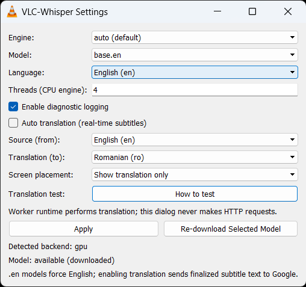
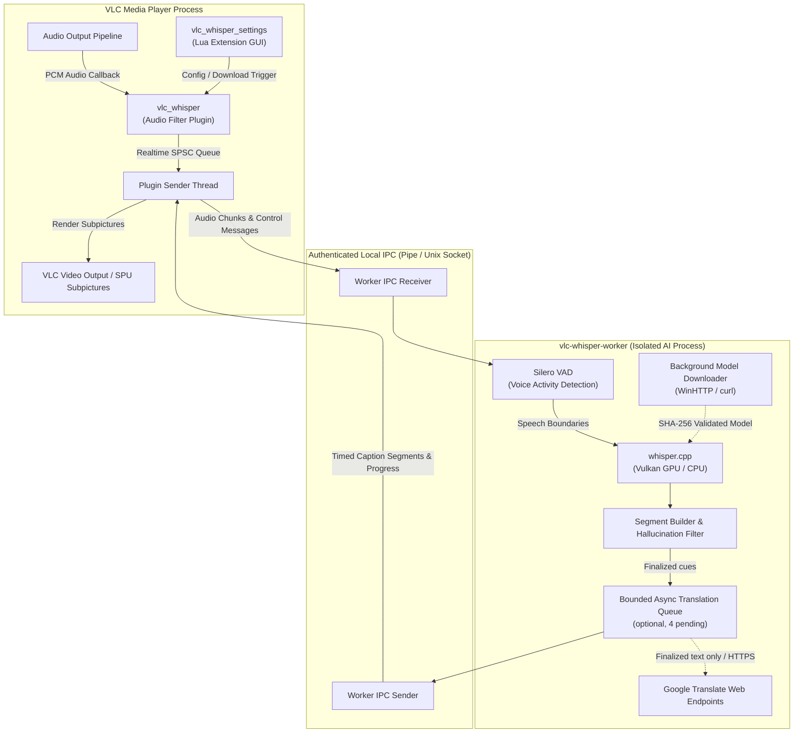

# VLC-Whisper

<p align="center">
  
</p>

<p align="center">
  <a href="https://github.com/rzv04/vlc-whisper/releases">
    
  </a>
  <a href="https://github.com/rzv04/vlc-whisper/actions/workflows/ci.yml">
    
  </a>
  
  
  
  
</p>

> **Private, offline, real-time AI subtitle generation for 10+ languages, with optional live translation into 250+ languages.**

Powered by [whisper.cpp](https://github.com/ggerganov/whisper.cpp) and [Silero VAD](https://github.com/snakers4/silero-vad), VLC-Whisper transcribes and translates speech in real time as you watch local media, over-the-network VoD and even IPTV livestreams. Audio processing and speech recognition run 100% locally on your device. Translation is done through Google Translate endpoints.

---

## Live Demo

<p align="center">
  <video
    src="https://github.com/user-attachments/assets/94ab40aa-f654-4441-b8fb-98575e29d946"
    width="900"
    controls>
  </video>
</p>

---

## Quick Start (Windows)

### Option 1: Standalone Installer (Recommended)

1. Grab `vlc-whisper-<version>-win64-setup.exe` from [Latest Releases](https://github.com/rzv04/vlc-whisper/releases), and run the setup wizard.
2. Open VLC using the newly created **"VLC (with AI Whisper Captions)"** desktop shortcut, and play any video - subtitles will appear on screen automatically!
3. Alternatively, open VLC, go to `Tools > Preferences (Ctrl+P) > Show settings > All > Audio > Filters` and select the `Offline Whisper AI Captions Filter` checkbox there. Useful when VLC is being launched by third-party apps, such as [IPTVnator](https://github.com/4gray/iptvnator).

### Option 2: Portable Archive (.zip)

1. Download `vlc-whisper-<version>-win64.zip` from [Releases](https://github.com/rzv04/vlc-whisper/releases).
2. Extract the archive directly into your VLC installation directory (e.g. `C:\Program Files\VideoLAN\VLC`).
3. Open a Command Prompt in your VLC directory and refresh the plugin cache (or manually delete `plugins.dat`:

   ```cmd

   vlc-cache-gen.exe "C:\Program Files\VideoLAN\VLC\plugins"
   ```

4. Enable the filter under `Tools > Preferences > Show settings: All > Audio > Filters`, and play a video.

---

## Key Features

- 🔒 **100% Offline & Private by Default**
- ⚡ **GPU Vulkan Acceleration**
- 🌐 **Real-Time Subtitle Translation Support**
- ⏩ **Lag-free experience<sup>_\*_</sup>**
- 🎛️ **In-VLC Settings Menu**
- 📦 **On-Demand Model Downloader**

_<sup>\*</sup> Aside from a small initial video start delay, seeking and play/pause should not cause any stutters or audio glitches._

---

## Configuring Settings in VLC

Open `View > VLC-Whisper Settings`from the VLC menu bar:



- **Engine (Backend)**: Choose the transcription backend. Auto is recommended and will use GPU acceleration when available.
- **Speech Model**: Switch between bundled `tiny` and downloaded models (`tiny.en`, `base`, `small`, `medium`, `large`). The `en` models are restricted to only transcribe English language with slightly better accuracy.
- **Audio Language**: Select the primary spoken language in your media (`English`, `Romanian`, `Spanish`, `French`, `German`, `Turkish`, etc.).
- **CPU Threads**: Number of CPU worker threads. The default of 4 is recommended for most systems.
- **Real-Time Translation**: Check the box to enable live translation of finalized subtitles. Choose **Dual line** (shows original speech and translation stacked) or **Translation only** (default).
- **Downloading Models**: Select any model in the dropdown and click **Download Selected Model**.

> [!WARNING]
> The settings menu is currently a Lua extension. Due to VLC extension limitations, the GUI may not fully update before you hit 'Apply', and might report wrong results (especially about downloaded models). Press the 'Apply' button to check if models were actually downloaded before.

---

## Frequently Asked Questions & Troubleshooting

<details>
<summary><b>Subtitles are not appearing when playing media</b></summary>

1. Verify that VLC was launched with the audio filter active. Check that you used the **"VLC (with AI Whisper Captions)"** shortcut, or check **Tools > Preferences > Show settings: All > Audio > Filters** and ensure **vlc_whisper** is checked.
2. Confirm the plugin cache is updated by running `vlc-cache-gen.exe "C:\Program Files\VideoLAN\VLC\plugins"` (or by deleting `plugins.dat`).
3. Check **View > VLC-Whisper Settings** to ensure a valid model is selected.
4. If all else fails, report a bug using the [issue tracker](https://github.com/rzv04/vlc-whisper/issues), using the specified template. **Ensure you provide logs!**
</details>

<details>
<summary><b>Playback is stuttering or high CPU usage</b></summary>

1. If you do not have a dedicated GPU, use the `tiny` or `base` models for smooth real-time transcription.
2. Adjust the CPU thread count in **View > VLC-Whisper Settings** to match your physical CPU core count (typically 4 or 6).
3. If using Vulkan GPU acceleration, ensure your graphics drivers are up to date.
4. If all else fails, report a bug using the [issue tracker](https://github.com/rzv04/vlc-whisper/issues), using the specified template. **Ensure you provide logs!**
</details>

<details>
<summary><b>How does privacy work when using translation?</b></summary>

- **Transcription & Audio**: 100% offline and local.
- **Model Downloads**: Explicit through the settings menu. Downloads official model weights from Hugging Face / GitHub over HTTPS with SHA-256 integrity verification.
- **Translation (Opt-In)**: When translation is enabled, finalized subtitle text strings are sent to Google Translate endpoints over HTTPS. Audio is never transmitted.
</details>

<details>
<summary><b>VLC keeps crashing!</b></summary>

1. Either disable the plugin, or uninstall it entirely, then replay a video or audio. If VLC still crashes, the issue might not be caused by VLC-Whisper.
2. If you believe the crash is caused by VLC-Whisper, report a bug using the [issue tracker](https://github.com/rzv04/vlc-whisper/issues), using the specified template. **Ensure you provide logs!**

</details>

<details>
<summary><b>How do I uninstall VLC-Whisper?</b></summary>

(**Recommended**) Go to `Control Panel > Programs > Uninstall a program` and uninstall **VLC-Whisper AI Subtitle Plugin**.
Or manually run `uninstall-vlc-whisper.exe` from your VLC installation directory, or use Windows `Settings > Apps > Installed apps > VLC-Whisper AI Subtitle Plugin > Uninstall`.

</details>

---

## Benchmark Results

> [!INFO]
> These results should only be treated as anecdotal and are not fully representative of actual whisper.cpp or VLC-Whisper performance.

Evaluated on FLEURS dataset subset (10 clips English, 10 clips Romanian) using `models/ggml-tiny.bin` (4 CPU threads):

| Language            | Mode              | Measured WER (%) | Measured CER (%) | Word Errors / Ref Words | Estimated WER (Excl. Duplicates)\* | Notes                                               |
| :------------------ | :---------------- | :--------------: | :--------------: | :---------------------: | :--------------------------------: | :-------------------------------------------------- |
| **English (`en`)**  | **`offline`**     |    **10.38%**    |    **4.97%**     |        22 / 212         |               10.38%               | Native batch whisper.cpp baseline                   |
| **English (`en`)**  | **`local media`** |    **10.38%**    |    **4.87%**     |        22 / 212         |               10.38%               | Same overall quality as the offline version         |
| **English (`en`)**  | **`livestream`**  |    **46.23%**    |    **39.32%**    |        98 / 212         |             **~13.2%**             | Measured rolling window (~70 duplicate insertions)  |
| **Romanian (`ro`)** | **`offline`**     |    **93.03%**    |    **29.71%**    |        227 / 244        |               93.03%               | Multilingual `tiny` baseline                        |
| **Romanian (`ro`)** | **`local media`** |    **89.75%**    |    **33.00%**    |        219 / 244        |               89.75%               | Real-time source demuxing                           |
| **Romanian (`ro`)** | **`livestream`**  |   **159.43%**    |    **91.52%**    |        389 / 244        |            **~83.61%**             | Measured rolling window (~185 duplicate insertions) |

_\* Theoretical estimation excludes excess word insertions caused by phrase deduplication leaks across consecutive rolling-window hops (English: 70 duplicate insertions deducted $\to$ 28/212 errors; Romanian: 185 duplicate insertions deducted $\to$ 204/244 errors)._

# Developer & Contributor Guide

The following technical sections are intended for developers, packagers, and contributors building VLC-Whisper from source.

## System Architecture

VLC-Whisper uses a two-process architecture to guarantee VLC media playback stability:



Please refer to the documentation at `docs/` to have an extensive view of the current architecture, dependencies, and decisions made.

---

## Building from Source

### Prerequisites

#### Ubuntu / Debian

```bash
# Core build system and compilers
sudo apt-get update && sudo apt-get install -y \
  cmake ninja-build build-essential gcc g++ clang-format valgrind gcovr nsis

# MinGW-w64 cross-compilers (for Windows targets)
sudo apt-get install -y \
  gcc-mingw-w64-x86-64 g++-mingw-w64-x86-64 binutils-mingw-w64-x86-64

# Vulkan SDK and shader compiler (for GPU acceleration)
sudo apt-get install -y libvulkan-dev glslc
```

#### Fedora / RHEL

```bash
sudo dnf install -y cmake ninja-build gcc gcc-c++ clang-tools-extra valgrind \
  mingw64-gcc mingw64-gcc-c++ vulkan-loader-devel glslc nsis
```

---

### Cloning the Repository

Clone recursively to initialize the `whisper.cpp` submodule:

```bash
git clone --recursive https://github.com/rzv04/vlc-whisper.git
cd vlc-whisper
```

---

### CMake Presets Reference

| Preset Name               | Target OS     | Backend                                       | Output Binary                | Purpose                             |
| :------------------------ | :------------ | :-------------------------------------------- | :--------------------------- | :---------------------------------- |
| `linux-x64-debug`         | Linux (Debug) | Vulkan GPU (auto CPU fallback)                | `vlc-whisper-worker`         | Linux development & tests           |
| `linux-x64-debug-cpu`     | Linux (Debug) | CPU-only                                      | `vlc-whisper-worker-cpu`     | CPU-only testing                    |
| `linux-x64-coverage`      | Linux (Debug) | CPU-only + gcov                               | `vlc-whisper-worker-cpu`     | Test code coverage                  |
| `windows-x64-release`     | Windows x64   | Vulkan GPU required; CPU fallback bundled     | `vlc-whisper-worker.exe`     | Production Windows installer (NSIS) |
| `windows-x64-release-cpu` | Windows x64   | CPU-only                                      | `vlc-whisper-worker-cpu.exe` | Explicit CPU-only release           |
| `windows-x64-debug`       | Windows x64   | Vulkan GPU (development may fall back to CPU) | `vlc-whisper-worker.exe`     | Windows debug symbols               |

> [!WARNING]
> About `windows-x64-release`: if the Vulkan SDK and `glslc` cannot be resolved, CMake stops instead of silently producing a CPU-only worker under the GPU release preset name. For the MinGW cross-build, provide a `VW_VULKAN_SDK` environment variable when the host packages are not sufficient. Use `windows-x64-release-cpu` when a CPU-only artifact is intentional.

---

### Compilation Commands

#### 1. Linux Native Build & Test

```bash
cmake --preset linux-x64-debug
cmake --build --preset linux-x64-debug -j4
ctest --preset linux-x64-debug --output-on-failure
```

#### 2. Windows Cross-Compilation (CPU-only, MinGW)

```bash
cmake --preset windows-x64-release-cpu
cmake --build --preset windows-x64-release-cpu -j4
```

A CPU-only installer removes (or schedules reboot-time removal of) any old `vlc-whisper-worker.exe` left by a previous GPU package.

#### 3. Building the Windows Installer (.exe & .zip)

Release packaging requires the exact `models/ggml-tiny.bin` and `models/ggml-silero-vad.bin`. Existing files are SHA-256 checked before they are accepted; a wrong or stale local file fails packaging instead of being bundled. Build-time downloads remain opt-in.

```bash
# Either place the two pinned model files under models/ yourself, or allow the
# provisioning target to fetch both once with their expected SHA-256 values.
cmake --preset windows-x64-release -DVW_PROVISION_MODELS=ON
cmake --build --preset windows-x64-release --target provision_models

# Build the GPU release. The installer target automatically builds and stages the CPU
# fallback in an isolated VW_WITH_VULKAN=OFF sub-build, then validates both workers
# plus the exact tiny and Silero VAD hashes before invoking NSIS.
cmake --build --preset windows-x64-release --target installer

# Package the portable ZIP archive; the package target builds the CPU fallback dependency.
# CPack uses an explicit model allowlist; extra gitignored models in models/ are excluded.
cpack --config build/windows-x64-release/CPackConfig.cmake
```

For an offline release build, omit `-DVW_PROVISION_MODELS=ON` and place the two files manually; the same SHA-256 verification still runs before packaging.

---

### Testing & Quality Assurance

#### Headless EN/RO ASR Quality Benchmark

A developer-only WER/CER regression benchmark lives under `tools/quality_benchmark/`. It is fully headless: it does not launch VLC, play audio, or require X11/Wayland or a Linux desktop environment. Configure a developer/test build with `VW_QUALITY_BENCHMARK_HOOKS=ON`, download the local FLEURS corpus explicitly, then run the Python orchestrator. The corpus and reports stay git-ignored and no media fixtures are committed.

```bash
python -m pip install -r tools/quality_benchmark/requirements.txt
python tools/quality_benchmark/vw_download_corpus.py
cmake --preset linux-x64-debug -DVW_QUALITY_BENCHMARK_HOOKS=ON
cmake --build --preset linux-x64-debug --target vw-quality-benchmark vlc-whisper-worker
python tools/quality_benchmark/vw_benchmark.py --build-dir build/linux-x64-debug --model models/ggml-tiny.bin
```

See `docs/quality-benchmark.md` for platform, completion-barrier, scoring, and reproducibility details. `tools/quality_benchmark/README.md` is the terse command reference.

#### Running Full Test Suite

```bash
ctest --preset linux-x64-debug --output-on-failure
```

#### Valgrind Memory Leak Verification

```bash
cmake --build --preset linux-x64-debug --target vw_memcheck_gate
```

#### Code Coverage

```bash
cmake --preset linux-x64-coverage && cmake --build --preset linux-x64-coverage
ctest --preset linux-x64-coverage
gcovr -r . --html-details build/coverage.html --exclude 'worker/third_party/' --exclude 'tests/'
```

---

## Open Source License & Attributions

VLC-Whisper is open-source software licensed under the [MIT License](LICENSE).

Third-party dependencies and assets:

- **whisper.cpp & ggml**: MIT License
- **OpenAI Whisper Models**: MIT License
- **Silero VAD Model**: MIT License
- **VLC Plugin API**: LGPL v2.1+ (Dynamic Linking / Out-of-tree plugin)
- **Vulkan SDK Headers**: Apache License 2.0
- **MinGW-w64 Runtime**: GNU GPL v3 with GCC Runtime Library Exception v3.1

See [THIRD_PARTY_NOTICES.md](THIRD_PARTY_NOTICES.md) for complete legal notices and component details.
