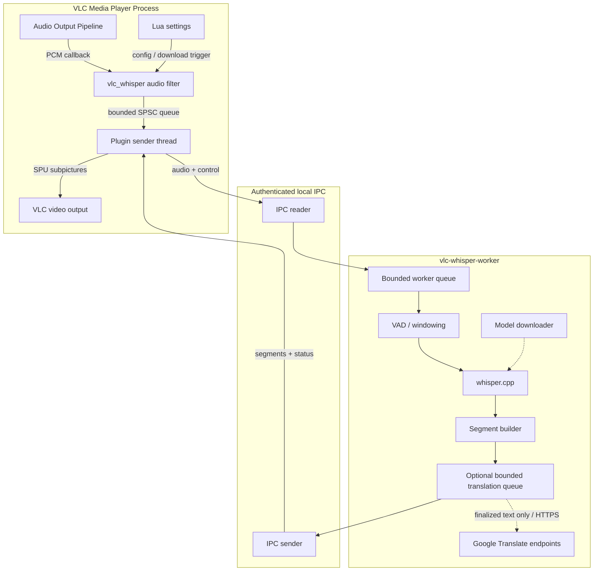

# VLC-Whisper

<p align="center">
  
</p>

<p align="center">
  <a href="https://github.com/rzv04/vlc-whisper/releases"></a>
  <a href="https://github.com/rzv04/vlc-whisper/actions/workflows/ci.yml"></a>
  
  
  
  
</p>

> **Private, local real-time AI captions for VLC, with optional live text translation.**

VLC-Whisper transcribes local media, network VoD, and live/non-seekable streams through a local `whisper.cpp` worker. Audio is never sent to a cloud transcription service. When translation is explicitly enabled, finalized subtitle text is sent to Google Translate endpoints over HTTPS.

## Live Demo

<p align="center">
  <video src="https://github.com/user-attachments/assets/94ab40aa-f654-4441-b8fb-98575e29d946" width="900" controls></video>
</p>

## Quick Start — Windows

### Installer (recommended)

1. Download `vlc-whisper-<version>-win64-setup.exe` from [Releases](https://github.com/rzv04/vlc-whisper/releases).
2. Run the installer.
3. Launch **VLC (with AI Whisper Captions)** and play media.

For VLC launched by another application, enable the filter under:

`Tools > Preferences > Show settings: All > Audio > Filters > Offline Whisper AI Captions Filter`

### Portable ZIP

1. Extract `vlc-whisper-<version>-win64.zip` into the VLC installation directory.
2. Refresh the plugin cache (or remove `plugins.dat`):

```cmd
vlc-cache-gen.exe "C:\Program Files\VideoLAN\VLC\plugins"
```

3. Enable the VLC-Whisper audio filter in VLC preferences.

## Features

- Local Whisper transcription with Vulkan GPU acceleration or CPU fallback.
- Local files, network VoD, IPTV, and live/non-seekable media.
- In-VLC settings for backend, model, language, threads, and translation.
- Explicit model downloads with SHA-256 integrity verification.
- Optional translation of finalized subtitle text.
- Worker-process isolation so caption failures do not block VLC playback.
- Seek, pause/resume, media-swap, and discontinuity handling through caption-session epochs.

## Settings

Open `View > VLC-Whisper Settings`.


- **Engine:** Auto is recommended; it uses GPU acceleration when available.
- **Speech model:** choose the bundled model or a downloaded catalog model. `.en` models are English-only.
- **Audio language:** choose the primary spoken language.
- **CPU threads:** `4` is a reasonable default for many systems.
- **Translation:** disabled by default; choose translation-only or dual-line display when enabled.
- **Model download:** choose a model and press **Download Selected Model**.

> [!WARNING]
> The settings UI is currently a VLC Lua extension. VLC extension limitations can leave displayed model/configuration state stale until **Apply** is pressed; treat the applied configuration as authoritative.

## Privacy and Network Behavior

> [!INFO]
> **Transcription audio stays local.** Network access is limited to explicit model downloads and opt-in translation. VLC-Whisper does not use cloud transcription or telemetry.

- **Transcription/audio:** local only.
- **Model downloads:** explicit user action; downloaded model bytes are integrity-checked before activation.
- **Translation:** opt-in; finalized subtitle text is sent over HTTPS. Audio is never sent for translation.
- **Logs:** diagnostics are opt-in and must not contain PCM, subtitle bodies, tokens, or credentials.

## Troubleshooting

<details>
<summary><b>Subtitles are not appearing</b></summary>

1. Confirm the VLC audio filter is enabled.
2. Refresh the VLC plugin cache if using the portable installation.
3. Open VLC-Whisper Settings and confirm a valid model, language, and backend.
4. If the issue persists, open a GitHub issue and include the requested diagnostics.
</details>

<details>
<summary><b>Playback is stuttering or CPU usage is high</b></summary>

1. Prefer a smaller model on CPU-only systems.
2. Keep the CPU thread count near the number of physical cores available to VLC-Whisper.
3. Update graphics drivers when using Vulkan.
4. Disable VLC-Whisper and replay the same media to determine whether playback is healthy without the plugin.
</details>

<details>
<summary><b>How do I uninstall VLC-Whisper?</b></summary>

Use **Control Panel > Programs > Uninstall a program**, Windows **Installed apps**, or the installed `uninstall-vlc-whisper.exe`.
</details>

## Benchmark Results

> [!INFO]
> These are anecdotal project regression measurements, not general `whisper.cpp` benchmarks. They use a small 20-clip FLEURS subset (10 English, 10 Romanian) and the bundled `tiny` model with 4 CPU threads.

| Language | Mode | WER | CER | Raw word errors / ref words | Est. errors excl. duplicate insertions* | Est. WER excl. duplicate insertions* |
| :--- | :--- | ---: | ---: | ---: | ---: | ---: |
| **English (`en`)** | **Offline** | **10.38%** | **4.97%** | 22 / 212 | — | — |
| **English (`en`)** | **Local media** | **10.38%** | **4.87%** | 22 / 212 | — | — |
| **English (`en`)** | **Livestream** | **46.23%** | **39.32%** | 98 / 212 | **~28 / 212** | **~13.21%** |
| **Romanian (`ro`)** | **Offline** | **93.03%** | **29.71%** | 227 / 244 | — | — |
| **Romanian (`ro`)** | **Local media** | **89.75%** | **33.00%** | 219 / 244 | — | — |
| **Romanian (`ro`)** | **Livestream** | **159.43%** | **91.52%** | 389 / 244 | **~204 / 244** | **~83.61%** |

_*The adjusted livestream values are diagnostic estimates, not separately measured scores: English deducts 70 duplicate-insertion errors (98 → 28), while Romanian deducts 185 (389 → 204). Reference-word counts remain unchanged because WER always divides by the original reference transcript length._

See [`docs/quality-benchmark.md`](docs/quality-benchmark.md) for methodology and [`docs/quality-benchmark-report.md`](docs/quality-benchmark-report.md) for the detailed historical analysis.

# Developer & Contributor Guide

## Architecture

VLC-Whisper separates realtime VLC integration from inference and network-capable worker tasks:



> [!INFO]
> The core engineering rule is **captioning may fail; playback must not**. The VLC audio callback performs bounded capture/enqueue work only. Inference, blocking IPC, filesystem access, downloads, translation, and teardown waits belong off that path.

Cross-component contracts are summarized in [`docs/invariants.md`](docs/invariants.md); detailed protocol semantics live in [`docs/api-contracts.md`](docs/api-contracts.md).

## Build Prerequisites

### Ubuntu / Debian

```bash
sudo apt-get update
sudo apt-get install -y cmake ninja-build build-essential gcc g++ clang-format valgrind gcovr nsis \
  gcc-mingw-w64-x86-64 g++-mingw-w64-x86-64 binutils-mingw-w64-x86-64 \
  libvulkan-dev glslc
```

### Fedora / RHEL

```bash
sudo dnf install -y cmake ninja-build gcc gcc-c++ clang-tools-extra valgrind \
  mingw64-gcc mingw64-gcc-c++ vulkan-loader-devel glslc nsis
```

## Clone and Build

```bash
git clone --recursive https://github.com/rzv04/vlc-whisper.git
cd vlc-whisper
```

| Preset | Purpose |
| --- | --- |
| `linux-x64-debug` | Native Linux development/tests |
| `linux-x64-debug-cpu` | CPU-only Linux development |
| `linux-x64-coverage` | Linux coverage build |
| `windows-x64-release` | Production Windows GPU release |
| `windows-x64-release-cpu` | Explicit CPU-only Windows release |
| `windows-x64-debug` | Windows development/debug build |

Typical native build:

```bash
cmake --preset linux-x64-debug
cmake --build --preset linux-x64-debug -j4
ctest --preset linux-x64-debug --output-on-failure
```

> [!WARNING]
> `windows-x64-release` is a GPU production preset and fails closed when Vulkan/`glslc` requirements cannot be resolved. Use `windows-x64-release-cpu` when a CPU-only artifact is intentional; do not silently relabel a CPU build as GPU-capable.

## Windows Packaging

Release packages require the pinned Whisper and Silero VAD model files. Explicit provisioning and packaging:

```bash
cmake --preset windows-x64-release -DVW_PROVISION_MODELS=ON
cmake --build --preset windows-x64-release --target provision_models
cmake --build --preset windows-x64-release --target installer
cpack --config build/windows-x64-release/CPackConfig.cmake
```

For offline packaging, provide the pinned model files manually and omit `VW_PROVISION_MODELS=ON`; the same SHA-256 checks still run.

## Verification

```bash
clang-format --dry-run --Werror <modified-c-files>
cmake --preset linux-x64-debug
cmake --build --preset linux-x64-debug
ctest --preset linux-x64-debug --output-on-failure
ctest --test-dir build/linux-x64-debug -T memcheck
```

> [!INFO]
> Model-gated tests may skip when their documented local model is absent. A Windows cross-build proves artifact creation, not runtime compatibility with VLC; release validation still requires the supported Windows/VLC environment.

## Local EN/RO Quality Benchmark

The developer regression benchmark is headless: it does not launch VLC, play audio, or require a Linux desktop. Corpus media and reports remain local and git-ignored.

```bash
python -m pip install -r tools/quality_benchmark/requirements.txt
python tools/quality_benchmark/vw_download_corpus.py
cmake --preset linux-x64-debug -DVW_QUALITY_BENCHMARK_HOOKS=ON
cmake --build --preset linux-x64-debug --target vw-quality-benchmark vlc-whisper-worker
python tools/quality_benchmark/vw_benchmark.py --build-dir build/linux-x64-debug --model models/ggml-tiny.bin
```

Use [`tools/quality_benchmark/README.md`](tools/quality_benchmark/README.md) for the terse command reference and [`docs/quality-benchmark.md`](docs/quality-benchmark.md) for scoring, completion, and reproducibility semantics.

## Documentation

Start with [`AGENTS.md`](AGENTS.md) and [`docs/invariants.md`](docs/invariants.md), then open only the technical reference relevant to the changed behavior.

- [`docs/architecture.md`](docs/architecture.md) — process/lifecycle architecture.
- [`docs/api-contracts.md`](docs/api-contracts.md) — IPC/API semantics.
- [`docs/test-strategy.md`](docs/test-strategy.md) — failure-path and seam-test rules.
- [`docs/roadmap.md`](docs/roadmap.md) — current and planned work.

## License

VLC-Whisper is MIT-licensed. See [THIRD_PARTY_NOTICES.md](THIRD_PARTY_NOTICES.md) for dependency and asset notices.
