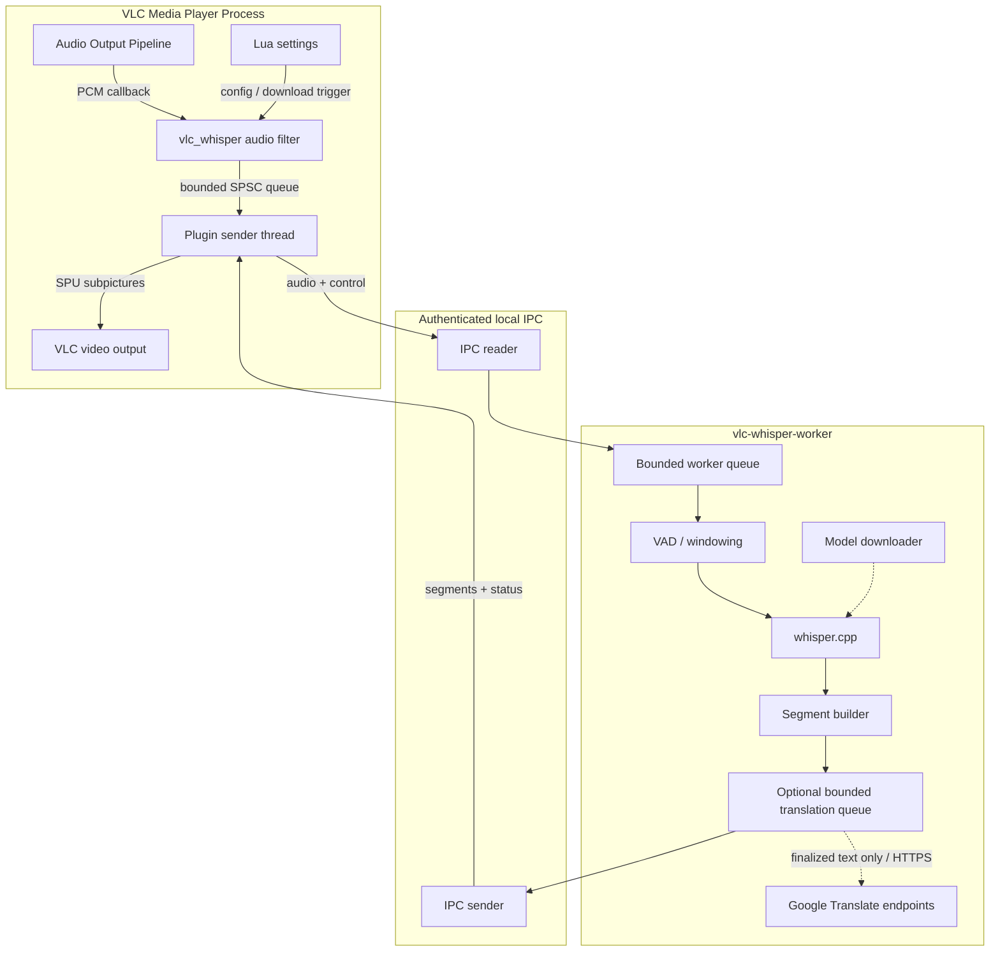

# VLC-Whisper


<p align="center">
  
</p>
  <p align="center"> <strong>Local real-time AI captions for VLC, with optional live text translation.</strong></p>
<p align="center">
  <a href="https://github.com/rzv04/vlc-whisper/releases"></a>
  <a href="https://github.com/rzv04/vlc-whisper/actions/workflows/ci.yml"></a>
  
  
  
  
</p>


VLC-Whisper transcribes local media and livestreams (IPTV, VoD, other network streams) with [whisper.cpp](https://github.com/ggml-org/whisper.cpp) into 10+ languages, with translation into 250+ languages through Google Translate.


<p align="center">
  <video src="https://github.com/user-attachments/assets/94ab40aa-f654-4441-b8fb-98575e29d946" width="900" controls></video>
</p>

## Quick Start - Windows

### Installer (recommended)

1. Download `vlc-whisper-<version>-win64-setup.exe` from [Releases](https://github.com/rzv04/vlc-whisper/releases).
2. Run the installer.
3. Launch **VLC (with AI Whisper Captions)** and play media.

For VLC launched by another application (such as [iptvnator](https://github.com/4gray/iptvnator/)), enable the filter under:

`Tools > Preferences > Show settings: All > Audio > Filters > Offline Whisper AI Captions Filter`

Uninstall is done through Control Panel.

## Quick Start - Ubuntu x64

VLC-Whisper currently supports the Ubuntu APT build of VLC **3.0.23 or newer**. Snap and Flatpak VLC installations are not supported.

### Install script (recommended)

```bash
curl -fsSL https://raw.githubusercontent.com/rzv04/vlc-whisper/main/scripts/install.sh | sh
```

### Manual .deb install

Download `vlc-whisper-ubuntu-24.04-amd64.deb` or `vlc-whisper-ubuntu-26.04-amd64.deb` package, depending on your Ubuntu version, from [Releases](https://github.com/rzv04/vlc-whisper/releases), then install it with:

```bash
sudo apt install ./vlc-whisper-ubuntu-<version>-amd64.deb
```

Uninstall with:

```bash
sudo apt remove vlc-whisper
```

## Features

- Local Whisper transcription with Vulkan GPU acceleration or CPU fallback.
- Real-time transcription of local files, network VoD, IPTV, and live/non-seekable media.
- Settings for backend, model, language, threads, and translation.
- Explicit model downloads with hash verification.
- Optional translation of subtitle text.
- Worker-process isolation so caption failures do not block VLC playback.
- Seek, pause/resume, media-swap, and discontinuity handling through caption-session epochs.

## Troubleshooting

<details>
<summary><b>Subtitles are not appearing</b></summary>

1. Confirm the VLC audio filter is enabled.
2. Refresh the VLC plugin cache if using the portable installation.
3. Open VLC-Whisper Settings and confirm a valid model, language, and backend.
4. If the issue persists, open a GitHub issue and include the requested diagnostics.
</details>

<details>
<summary><b>Playback is stuttering or CPU usage is high</b></summary>

1. Prefer a smaller model on CPU-only systems.
2. Keep the CPU thread count near the number of physical cores available to VLC-Whisper.
3. Update graphics drivers when using Vulkan.
4. Disable VLC-Whisper and replay the same media to determine whether playback is healthy without the plugin.
</details>

<details>
<summary><b>How do I uninstall VLC-Whisper?</b></summary>

On Windows, use **Control Panel > Programs > Uninstall a program**, Windows **Installed apps**, or the installed `uninstall-vlc-whisper.exe`. On Ubuntu, run `sudo apt remove vlc-whisper`.
</details>

## Benchmark Results

> [!NOTE]
> These are anecdotal project regression measurements, not general `whisper.cpp` benchmarks. They use a small 20-clip FLEURS subset (10 English, 10 Romanian) and the bundled `tiny` model with 4 CPU threads.

| Language | Mode | WER | CER | WER excl. insertions* | CER excl. insertions* | Raw word errors / ref words |
| :--- | :--- | ---: | ---: | ---: | ---: | ---: |
| **English (`en`)** | **Offline** | **10.38%** | **4.97%** | **7.55%** | **3.77%** | 22 / 212 |
| **English (`en`)** | **Local media** | **10.38%** | **4.87%** | **7.55%** | **3.67%** | 22 / 212 |
| **English (`en`)** | **Livestream** | **46.23%** | **39.32%** | **10.38%** | **5.16%** | 98 / 212 |
| **Romanian (`ro`)** | **Offline** | **93.03%** | **29.71%** | **74.59%** | **25.68%** | 227 / 244 |
| **Romanian (`ro`)** | **Local media** | **89.75%** | **33.00%** | **75.82%** | **29.47%** | 219 / 244 |
| **Romanian (`ro`)** | **Livestream** | **159.43%** | **91.52%** | **69.67%** | **24.28%** | 389 / 244 |

_*These are not standard WER/CER scores; Due to the current rolling-window approach to transcription, duplicated words are major contributors to the error rates._

See [`docs/quality-benchmark.md`](docs/quality-benchmark.md) for methodology and benchmark options.

# Developer & Contributor Guide

## Architecture

VLC-Whisper separates realtime VLC integration from inference and network-capable worker tasks:



> [!NOTE]
> The core architectural rule is **captioning may fail; playback must not**. Transcription and other work must be offloaded to background workers, (_with the exception of media start and end_), and must not block the video playback.

Cross-component contracts are summarized in [`docs/invariants.md`](docs/invariants.md); detailed protocol semantics live in [`docs/api-contracts.md`](docs/api-contracts.md).

## Build Prerequisites

### Ubuntu / Debian

```bash
sudo apt-get update
sudo apt-get install -y cmake ninja-build build-essential gcc g++ clang-format valgrind gcovr nsis curl pkg-config dpkg-dev \
  gcc-mingw-w64-x86-64 g++-mingw-w64-x86-64 binutils-mingw-w64-x86-64 \
  libavformat-dev libavcodec-dev libswresample-dev libavutil-dev libvulkan-dev glslc spirv-headers
```

### Fedora / RHEL

```bash
sudo dnf install -y cmake ninja-build gcc gcc-c++ clang-tools-extra valgrind \
  mingw64-gcc mingw64-gcc-c++ vulkan-loader-devel glslc nsis
```

## Clone and Build

```bash
git clone --recursive https://github.com/rzv04/vlc-whisper.git
cd vlc-whisper
```

| Preset | Purpose |
| --- | --- |
| `linux-x64-release` | Ubuntu/Debian x64 release + DEB packaging |
| `linux-x64-debug` | Native Linux development/tests |
| `linux-x64-debug-cpu` | CPU-only Linux development |
| `linux-x64-coverage` | Linux coverage build |
| `windows-x64-release` | Production Windows GPU release |
| `windows-x64-release-cpu` | Explicit CPU-only Windows release |
| `windows-x64-debug` | Windows development/debug build |

Typical native build:

```bash
cmake --preset linux-x64-debug
cmake --build --preset linux-x64-debug -j4
ctest --preset linux-x64-debug --output-on-failure
```

> [!WARNING]
> `windows-x64-release` is a GPU production preset and fails closed when Vulkan/`glslc` requirements cannot be resolved. Use `windows-x64-release-cpu` when a CPU-only artifact is intentional; do not silently relabel a CPU build as GPU-capable.

## Windows Packaging

Release packages require the pinned Whisper and Silero VAD model files. Explicit provisioning and packaging:

```bash
cmake --preset windows-x64-release -DVW_PROVISION_MODELS=ON
cmake --build --preset windows-x64-release --target provision_models
cmake --build --preset windows-x64-release --target installer
cpack --config build/windows-x64-release/CPackConfig.cmake
```

For offline packaging, provide the pinned model files manually and omit `VW_PROVISION_MODELS=ON`; the same SHA-256 checks still run.

## Linux Packaging

The two release packages must be built in their matching Ubuntu userspace. Build the Ubuntu 24.04 package inside Ubuntu 24.04 (Noble), and the Ubuntu 26.04 package inside Ubuntu 26.04 (Resolute), using a VM, container, chroot, or native installation. Do not build both release artifacts from one arbitrary host and merely rename them.

Install the release-build dependencies inside each environment:

```bash
apt-get update
apt-get install -y git cmake ninja-build build-essential gcc g++ curl pkg-config dpkg-dev file \
  libavformat-dev libavcodec-dev libswresample-dev libavutil-dev libvulkan-dev glslc spirv-headers
```

From a recursive clone of the repository, build the matching package.

### Ubuntu 24.04 (Noble)

```bash
cmake --preset linux-x64-release \
  -DCPACK_PACKAGE_FILE_NAME=vlc-whisper-ubuntu-24.04-amd64 \
  -DVW_PROVISION_MODELS=ON
cmake --build --preset linux-x64-release -j2 --target package

sha256sum --check build/linux-x64-release/vlc-whisper-ubuntu-24.04-amd64.deb.sha256
dpkg-deb --info build/linux-x64-release/vlc-whisper-ubuntu-24.04-amd64.deb
```

Outputs:

- `build/linux-x64-release/vlc-whisper-ubuntu-24.04-amd64.deb`
- `build/linux-x64-release/vlc-whisper-ubuntu-24.04-amd64.deb.sha256`

### Ubuntu 26.04 (Resolute)

```bash
cmake --preset linux-x64-release \
  -DCPACK_PACKAGE_FILE_NAME=vlc-whisper-ubuntu-26.04-amd64 \
  -DVW_PROVISION_MODELS=ON
cmake --build --preset linux-x64-release -j2 --target package

sha256sum --check build/linux-x64-release/vlc-whisper-ubuntu-26.04-amd64.deb.sha256
dpkg-deb --info build/linux-x64-release/vlc-whisper-ubuntu-26.04-amd64.deb
```

Outputs:

- `build/linux-x64-release/vlc-whisper-ubuntu-26.04-amd64.deb`
- `build/linux-x64-release/vlc-whisper-ubuntu-26.04-amd64.deb.sha256`

For offline packaging, provision the pinned Whisper and Silero VAD model files manually and omit `-DVW_PROVISION_MODELS=ON`; the package build still verifies the configured model hashes.

> [!WARNING]
> Compiling Vulkan shader translation units (`ggml-vulkan`) under `-O3` requires significant memory. On systems with less than 8 GB of RAM or without swap space, limit parallel build jobs (for example, `-j2` or `-j1`) to prevent compiler out-of-memory (OOM) termination:
> ```bash
> cmake --build --preset linux-x64-release -j2
> ```

## Verification

```bash
clang-format --dry-run --Werror <modified-c-files>
cmake --preset linux-x64-debug
cmake --build --preset linux-x64-debug
ctest --preset linux-x64-debug --output-on-failure
ctest --test-dir build/linux-x64-debug -T memcheck
```

> [!INFO]
> Model-gated tests may skip when their documented local model is absent. A Windows cross-build proves artifact creation, not runtime compatibility with VLC; release validation still requires the supported Windows/VLC environment.

## Local EN/RO Quality Benchmark

The developer regression benchmark is headless: it does not launch VLC, play audio, or require a Linux desktop. Corpus media and reports remain local and git-ignored.

```bash
python -m pip install -r tools/quality_benchmark/requirements.txt
python tools/quality_benchmark/vw_download_corpus.py
cmake --preset linux-x64-debug -DVW_QUALITY_BENCHMARK_HOOKS=ON
cmake --build --preset linux-x64-debug --target vw-quality-benchmark vlc-whisper-worker
python tools/quality_benchmark/vw_benchmark.py --build-dir build/linux-x64-debug --model models/ggml-tiny.bin
```

Use [`tools/quality_benchmark/README.md`](tools/quality_benchmark/README.md) for the terse command reference and [`docs/quality-benchmark.md`](docs/quality-benchmark.md) for scoring, completion, and reproducibility semantics.

## Documentation

Start with [`AGENTS.md`](AGENTS.md) and [`docs/invariants.md`](docs/invariants.md), then open only the technical reference relevant to the changed behavior.

- [`docs/architecture.md`](docs/architecture.md) - process and lifecycle architecture.
- [`docs/api-contracts.md`](docs/api-contracts.md) - IPC protocol and API wire semantics.
- [`docs/roadmap.md`](docs/roadmap.md) - current and planned work.

## License

VLC-Whisper is MIT-licensed. See [THIRD_PARTY_NOTICES.md](THIRD_PARTY_NOTICES.md) for dependency and asset notices.
