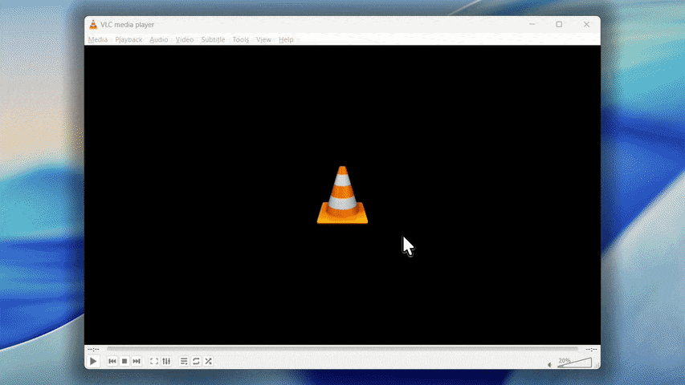
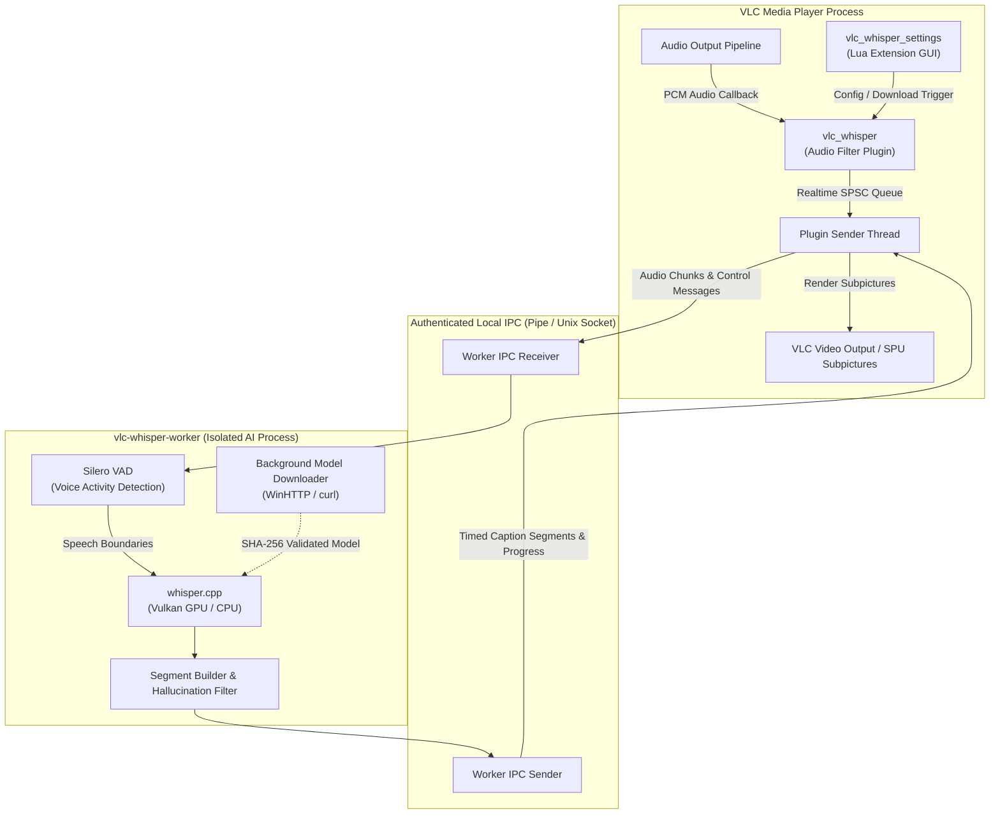

# VLC-Whisper

<p align="center">
  
</p>

<p align="center">
  <a href="https://github.com/rzv04/vlc-whisper/actions/workflows/ci.yml">
    
  </a>
  <a href="https://github.com/rzv04/vlc-whisper/releases">
    
  </a>
  <a href="./LICENSE">
    
  </a>
  
  
  
</p>

**VLC-Whisper** brings private, offline, real-time AI speech recognition and subtitle generation directly into VLC media player. Powered by [whisper.cpp](https://github.com/ggerganov/whisper.cpp) and [Silero VAD](https://github.com/snakers4/silero-vad), it automatically transcribes and displays synchronized subtitles for any audio or video file without sending data to the cloud.

---

## Live Demo

<br>

<p align="center">
  
</p>

---

## Key Highlights

- **100% Private and Offline**: All audio processing, voice activity detection, and speech recognition run entirely on your local machine. Zero cloud APIs, zero telemetry, and zero data leaves your computer.
- **Hardware-Accelerated**: Supports Vulkan GPU acceleration for fast real-time transcription, with automatic CPU fallback on systems without dedicated graphics.
- **Ahead-of-Time Lookahead**: When playing local media files, the worker decodes upcoming audio ahead of the playback playhead for instant subtitle availability.
- **Voice Activity Detection**: Integrated Silero VAD prevents phantom captions during silence, instrumental music, or background noise.
- **In-App Settings Extension**: Configure speech models, language selection, inference threads, and hardware backend directly from VLC via the `View > VLC-Whisper Settings` menu.
- **On-Demand Model Downloads**: Comes bundled with the universal multilingual `tiny` model. Download larger or specialized models (`tiny.en`, `base`, `small`, `medium`, `large-v3`) on demand directly within VLC.
- **Zero Runtime Dependencies**: The Windows worker and plugin are statically linked with MinGW runtime for standalone plug-and-play installation.

---

## Quick Start for End Users (Windows)

For users running VLC media player 3.0 (64-bit) on Windows 10 or 11:

### Option 1: Standalone Installer (Recommended)

1. Download the latest installer `vlc-whisper-0.3.0-win64-setup.exe` from [Releases](https://github.com/rzv04/vlc-whisper/releases).
2. Run the installer. It automatically:
   - Detects your 64-bit VLC installation directory (e.g., `C:\Program Files\VideoLAN\VLC`).
   - Deploys `libvlc_whisper_plugin.dll` to `plugins\audio_filter\`.
   - Places the AI worker and bundled models into your VLC directory.
   - Rebuilds the VLC plugin cache (`plugins.dat`).
   - Creates a **"VLC (with AI Whisper Captions)"** desktop shortcut.
3. Launch VLC using the created shortcut (or start VLC with `--audio-filter=vlc_whisper`).
4. Play any video or audio file. Subtitles will appear automatically at the bottom of the screen.

### Option 2: Portable Archive (.zip)

1. Download `vlc-whisper-0.3.0-win64.zip` from [Releases](https://github.com/rzv04/vlc-whisper/releases).
2. Extract the contents directly into your VLC installation folder (e.g., `C:\Program Files\VideoLAN\VLC`).
3. Open a terminal in the VLC directory and rebuild the plugin cache:
   ```cmd
   vlc-cache-gen.exe "C:\Program Files\VideoLAN\VLC\plugins"
   ```
4. Launch VLC with `--audio-filter=vlc_whisper`.

---

## Configuring Settings in VLC

VLC-Whisper includes a built-in settings dialog accessible from the VLC menu bar:

1. Open **View > VLC-Whisper Settings** (or **Tools > Extensions > VLC-Whisper Settings**).
2. Adjust your preferred configuration:
   - **Engine (Backend)**: `auto` (default, probes GPU and falls back to CPU), `gpu` (Vulkan), or `cpu`.
   - **Model**: Choose from bundled `tiny (multilingual)` or additional models (`tiny.en`, `base.en`, `base`, `small`, `medium`, `large`).
   - **Language**: Select your target language (`English`, `Romanian`, `Turkish`, `German`, `French`, `Spanish`).
   - **Threads**: CPU inference worker threads (`1` to `16`, default `4`).
3. Click **Apply** to save the configuration. The worker restarts seamlessly with the new settings.

### Downloading Additional Models

The installer includes the lightweight multilingual `ggml-tiny.bin` model out of the box. To download higher-accuracy models:

1. Open **View > VLC-Whisper Settings**.
2. Select your desired model in the **Model** dropdown.
3. Click **Download Selected Model**.
4. Start media playback if VLC is idle. The worker downloads the model in the background over a secure HTTPS connection and validates its SHA-256 checksum.
5. Downloaded models are stored in your per-user app directory (`%LOCALAPPDATA%\vlc-whisper\models` on Windows, `~/.local/share/vlc-whisper/models` on Linux). Once complete, the plugin automatically activates the new model.

> [!NOTE]
> Pausing media playback does not interrupt or pause ongoing model downloads.

---

## Architecture Overview

VLC-Whisper uses an isolated two-process architecture to guarantee VLC media playback stability:



- **Plugin Layer (`libvlc_whisper_plugin`)**: An out-of-tree VLC `audio_filter` plugin that captures audio PCM frames in real time without blocking VLC's audio pipeline (zero locks, zero heap allocation in audio callbacks).
- **Worker Layer (`vlc-whisper-worker`)**: A standalone background process that performs heavy speech recognition and VAD inference off the main VLC process.
- **Secure Local IPC**: Authenticated communication over local named pipes (Windows) or Unix domain sockets (Linux) secured by a per-session 32-byte secret token.

---

## Developer Guide & Building from Source

### System Prerequisites

Install the necessary build dependencies for your development platform:

#### Ubuntu / Debian

```bash
# Core build system and native compilers
sudo apt-get update && sudo apt-get install -y \
  cmake ninja-build build-essential gcc g++ clang-format valgrind gcovr nsis

# MinGW-w64 cross-compilers (required for Windows x64 targets)
sudo apt-get install -y \
  gcc-mingw-w64-x86-64 g++-mingw-w64-x86-64 binutils-mingw-w64-x86-64

# Vulkan SDK and shader compiler (required for Linux GPU acceleration)
sudo apt-get install -y libvulkan-dev glslc
```

#### Fedora / RHEL

```bash
sudo dnf install -y cmake ninja-build gcc gcc-c++ clang-tools-extra valgrind \
  mingw64-gcc mingw64-gcc-c++ vulkan-loader-devel glslc nsis
```

---

## Cloning the Project

The repository includes `whisper.cpp` as a Git submodule in `worker/third_party/whisper.cpp`. Clone recursively so all submodules are initialized:

```bash
git clone --recursive <repository-url>
cd vlc-whisper
```

If you already cloned without `--recursive`, initialize submodules before configuring CMake:

```bash
git submodule update --init --recursive
```

### Optional: enable [conventional-commits](https://www.conventionalcommits.org/en/v1.0.0/) hook locally ([conventional-commits](https://www.conventionalcommits.org/en/v1.0.0/) will be enforced in CI)

```bash
git config --local core.hooksPath .githooks
```

---

## Building the Project

The project uses CMake (minimum version 3.20) with Ninja and CMake Presets for both native Linux development and cross-compiling standalone Windows x64 binaries via MinGW GCC.

### Available Presets in `CMakePresets.json`

| Preset Name               | Target OS & Type      | Backend                        | Output Worker Binary         | Notes                                      |
| ------------------------- | --------------------- | ------------------------------ | ---------------------------- | ------------------------------------------ |
| `linux-x64-debug`         | Linux Native (Debug)  | Vulkan GPU (auto CPU fallback) | `vlc-whisper-worker`         | Primary Linux dev & test target            |
| `linux-x64-debug-cpu`     | Linux Native (Debug)  | CPU-only                       | `vlc-whisper-worker-cpu`     | No Vulkan/glslc requirement                |
| `linux-x64-coverage`      | Linux Native (Debug)  | CPU-only + gcov                | `vlc-whisper-worker-cpu`     | Code coverage instrumentation              |
| `windows-x64-release`     | Windows x64 (Release) | Vulkan GPU (auto CPU fallback) | `vlc-whisper-worker.exe`     | Requires `VW_VULKAN_SDK` (see below)       |
| `windows-x64-release-cpu` | Windows x64 (Release) | CPU-only                       | `vlc-whisper-worker-cpu.exe` | Fully self-contained, no Vulkan SDK needed |
| `windows-x64-debug`       | Windows x64 (Debug)   | Vulkan GPU (auto CPU fallback) | `vlc-whisper-worker.exe`     | Debug symbols included                     |
| `windows-x64-debug-cpu`   | Windows x64 (Debug)   | CPU-only                       | `vlc-whisper-worker-cpu.exe` | Debug symbols, CPU-only                    |

---

### Building on Linux (Native)

#### 1. Linux GPU Build (Vulkan Acceleration)

Requires `libvulkan-dev` and `glslc`.

```bash
cmake --preset linux-x64-debug
# NOTE: the Vulkan-enabled linux-x64-debug preset MUST build with -j1 on
# 8 GB-RAM machines: ggml-vulkan's mul_mm.comp.cpp alone can consume most of
# the memory and parallel cc1plus instances get OOM-killed (silent build fail).
cmake --build --preset linux-x64-debug -j1
ctest --preset linux-x64-debug --output-on-failure
```

_(If `glslc` or `libvulkan-dev` is missing, CMake will warn and automatically degrade to building `vlc-whisper-worker-cpu`)._

#### 2. Linux CPU-Only Build

```bash
cmake --preset linux-x64-debug-cpu
cmake --build --preset linux-x64-debug-cpu -j4
```

---

### Building for Windows (MinGW Cross-Compilation from Linux)

#### 1. Windows CPU-Only Build (No Vulkan SDK required)

Produces statically-linked, standalone Windows binaries with zero external DLL dependencies:

```bash
cmake --preset windows-x64-release-cpu
cmake --build --preset windows-x64-release-cpu -j4
```

_Outputs_: `build/windows-x64-release-cpu/bin/vlc-whisper-worker-cpu.exe` and `build/windows-x64-release-cpu/bin/libvlc_whisper_plugin.dll`.

#### 2. Windows GPU Build (Vulkan Accelerated)

Cross-compiling `ggml-vulkan` for Windows requires target Windows Vulkan import headers and MinGW library (`libvulkan-1.a`).

Set the `VW_VULKAN_SDK` environment variable pointing to the Windows Vulkan MinGW layout:

```text
$VW_VULKAN_SDK/
├── mingw/
│   ├── include/vulkan/ (vulkan.h, etc.)
│   └── lib/libvulkan-1.a
└── spv/
    └── include/spirv/ (unified1/spirv.h, etc.)
```

Build command:

```bash
VW_VULKAN_SDK=/path/to/vulkan-sdk cmake --preset windows-x64-release
cmake --build --preset windows-x64-release -j4
```

_(Without `VW_VULKAN_SDK`, `windows-x64-release` prints a warning and automatically falls back to producing the CPU-only worker `vlc-whisper-worker-cpu.exe`)._

---

### GPU (Vulkan) Runtime Notes & Build Memory Limits

- **Runtime Fallback**: When `--backend auto` (default) or `--backend gpu` is used, `whisper.cpp` probes the GPU and transparently falls back to CPU if no physical Vulkan driver or GPU is present at runtime.
- **Worker CLI Flags**: Pass `--backend auto|gpu|cpu` or `--gpu-device <id>` when launching the worker manually.
- **Build RAM Usage and Memory Limits**: Compiling Vulkan SPIR-V shaders (`glslc`) creates high memory pressure during C++ compilation. On systems with <=8 GB RAM or virtual machines, limit build concurrency to `-j1` or `-j2` (for example, `cmake --build --preset linux-x64-debug -j1`) to prevent parallel compiler processes from exhausting RAM and being terminated by the out-of-memory killer. CPU-only presets (`*-cpu`) do not invoke `glslc` and build with minimal memory usage.

---

## Testing & Verification

The project includes unit and integration test suites covering protocol serialization, audio ring buffers, VAD chunking, whisper decoding, and worker IPC lifecycle.

### Running Tests with CMake Presets (Linux Native)

```bash
# Configure native Linux debug build
cmake --preset linux-x64-debug

# Build tests (use -j1 or -j2 on low-RAM hosts)
cmake --build --preset linux-x64-debug -j4

# Execute the test suite
ctest --preset linux-x64-debug --output-on-failure
```

### Valgrind Memory Leak Verification

Run the entire test suite under Valgrind memcheck to ensure zero memory leaks, uninitialized memory accesses, or buffer overruns:

```bash
cmake --build --preset linux-x64-debug -j$(nproc)
ctest --test-dir build/linux-x64-debug -T memcheck --output-on-failure \
  --extra-memcheck-options=--leak-check=full \
  --extra-memcheck-options=--error-exitcode=1
```

### Code Coverage Reports (Linux Native)

To measure test coverage across all project-authored C17 code (excluding third-party dependencies):

```bash
# Configure coverage preset
cmake --preset linux-x64-coverage

# Build and execute tests
cmake --build --preset linux-x64-coverage
ctest --preset linux-x64-coverage

# Generate HTML coverage report in build/coverage.html
gcovr -r . --html-details build/coverage.html --exclude 'worker/third_party/' --exclude 'tests/'

# Or output coverage summary to terminal
gcovr -r . --exclude 'worker/third_party/' --exclude 'tests/'
```

---

## Compiling the Windows Installer & Release Packages

To compile the standalone Windows installer wizard with embedded GPU worker and CPU fallback (requires `nsis`):

```bash
# 1. Build CPU fallback worker (bundled alongside GPU worker if present)
cmake --preset windows-x64-release-cpu
cmake --build --preset windows-x64-release-cpu -j4
cp build/windows-x64-release-cpu/worker/vlc-whisper-worker-cpu.exe build/windows-x64-release/worker/ 2>/dev/null || true

# 2. Build release binaries and NSIS setup wizard
cmake --preset windows-x64-release
cmake --build --preset windows-x64-release --target installer

# 3. Generate portable ZIP archive
cpack --config build/windows-x64-release/CPackConfig.cmake
```

Outputs generated in `build/windows-x64-release/`:

- `vlc-whisper-0.3.0-win64-setup.exe` (Standalone Windows setup wizard)
- `vlc-whisper-0.3.0-win64.zip` (Portable release archive)

---

## Building Sample Snippets

Standalone demonstration snippets located in `samples/snippets/` are registered as individual CMake targets (`sample_<name>`):

```bash
# Build a specific snippet
cmake --build --preset windows-x64-release --target sample_whisper_pcm

# Build all sample snippets
cmake --build --preset windows-x64-release --target samples
```

Sample binaries are generated in `build/windows-x64-release/samples/` and accept model paths via command-line arguments:

```cmd
sample_whisper_pcm.exe C:\path\to\ggml-tiny.bin
```

---

## Static Runtime Linking (MinGW)

The MinGW cross-compilation toolchain automatically applies static runtime linking (`-static`, `-static-libgcc`, `-static-libstdc++`, static `libgomp.a`, and static `libwinpthread.a`).

All output binaries (`vlc-whisper-worker.exe`, `libvlc_whisper_plugin.dll`, and sample executables) are completely self-contained and run natively on Windows without requiring external MinGW runtime DLLs (`libgomp-1.dll`, `libwinpthread-1.dll`, `libstdc++-6.dll`).

---

## Manual Plugin Installation (Windows Developer Workflow)

To manually install and test the plugin during local development:

1. **Install Plugin DLL**: Copy `libvlc_whisper_plugin.dll` to your VLC installation folder:
   - Path: `C:\Program Files\VideoLAN\VLC\plugins\audio_filter\libvlc_whisper_plugin.dll`
2. **Install AI Worker**: Copy `vlc-whisper-worker.exe` to your VLC root folder:
   - Path: `C:\Program Files\VideoLAN\VLC\vlc-whisper-worker.exe`
3. **Install Lua Settings Extension**: Copy `lua\extensions\vlc_whisper_settings.lua`:
   - Path: `C:\Program Files\VideoLAN\VLC\lua\extensions\vlc_whisper_settings.lua`
4. **Install Models**:
   - Speech Model: `C:\Program Files\VideoLAN\VLC\models\ggml-tiny.bin`
   - VAD Model: `C:\Program Files\VideoLAN\VLC\models\ggml-silero-vad.bin`
5. **Rebuild Cache and Launch VLC**:
   ```cmd
   "C:\Program Files\VideoLAN\VLC\vlc-cache-gen.exe" "C:\Program Files\VideoLAN\VLC\plugins"
   "C:\Program Files\VideoLAN\VLC\vlc.exe" -vvv --audio-filter=vlc_whisper C:\path\to\media.mp4
   ```

---

## Open Source License & Third-Party Notices

VLC-Whisper is released under the permissive [MIT License](LICENSE).

All bundled models and runtime components adhere to open-source licensing:

- `whisper.cpp` & `ggml`: MIT License
- OpenAI Whisper Models: MIT License
- Silero VAD Models: MIT License
- VLC Media Player Plugin API: LGPL v2.1+ (Dynamic Linking / Out-of-tree plugin)
- Windows Media Foundation: Standard Windows OS Component
- Vulkan SDK Headers & Loader: Apache License 2.0
- MinGW-w64 Runtime: GNU GPL v3 with GCC Runtime Library Exception v3.1

See [THIRD_PARTY_NOTICES.md](THIRD_PARTY_NOTICES.md) for full legal attributions and license texts.
