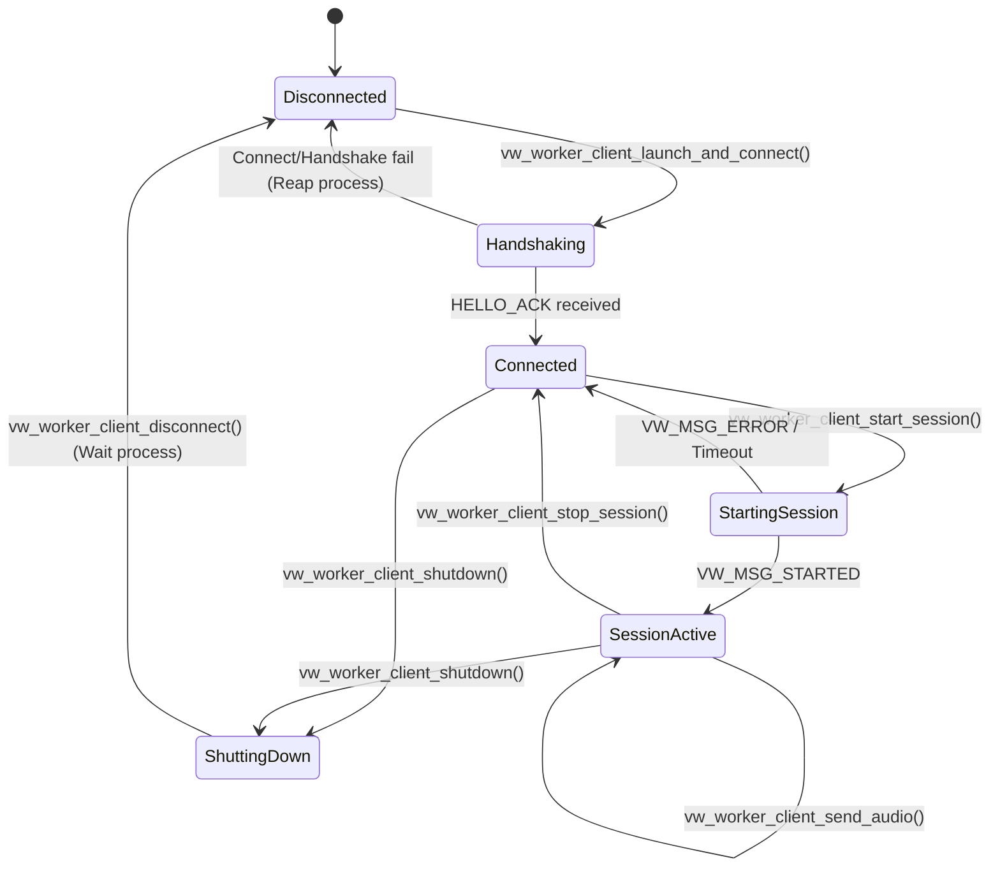
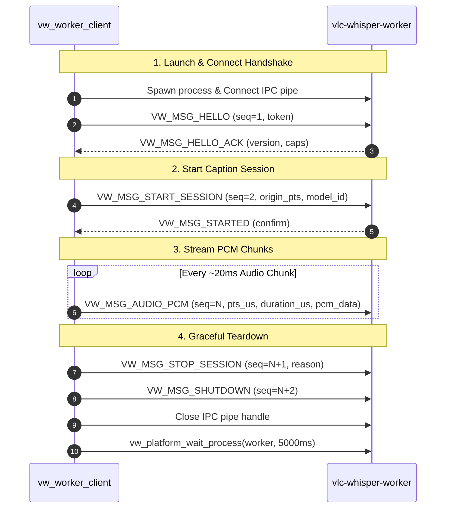

# Diff Analysis: milestone-3-step-14b (client-API slice)

**15 files changed, +764 / -440 lines** (14 tracked + 1 new: `tests/unit/vw_test_worker_client.c`, +177)
**Base**: merge-base `6af3fc6` (`gemini/milestone-3`) → tip `efe7033` (`gemini/milestone-3-step-14b`), 5 commits `2aaa920..efe7033`
**Scope**: Roadmap 14b — the `vw_worker_client` session send API (START/AUDIO/STOP/SHUTDOWN), process supervision (spawn out-handle, wait, terminate with reap, monotonic-clock deadlines), a transport receive-timeout API, and the hermetic client test. Includes the four Greptile review-fix rounds (monotonic deadlines, terminate-on-timeout, transport drop on partial send, unreaped-pid registry). The module background sender thread and the ADR-013 worker thread split are **not** part of this diff.

**Verification state (run 2026-08-07, linux-x64-debug)**:
- Build: ✅ pass
- ctest: ✅ 15/15 (`test_worker_client` 0.20s)
- Valgrind memcheck: ✅ clean (test_worker_client, test_platform, test_worker_lifecycle)
- clang-format `--dry-run --Werror`: ✅ **PASS — 0 violations**
- Windows MinGW cross-build of `test_worker_client`: ✅ **PASS — bcrypt target dependency resolved**

---

## 1. Architecture & State Overview

### 1.1 Client State Machine

---

## 2. File-by-File Analysis

### 2.1 `plugin/include/vw_platform.h`

**Why change**: Step 14b requires process supervision — the plugin must track the spawned worker and reap it on close instead of the fire-and-forget spawn from 14a. The platform abstraction needs a process-handle type, a spawn out-parameter, and a wait primitive.

**Responsibility before**: Declared `vw_platform_spawn_process(exec, argv)` (fire-and-forget) plus random/time/thread helpers. **After**: Adds `vw_process_t` (`void*` on Win32, `int` pid on POSIX), an `out_process` out-param on `vw_platform_spawn_process`, and new `vw_platform_wait_process(process, timeout_ms)`. Doc comments updated/added on all touched functions (Rule 11 satisfied here).

**Callers**: `vw_worker_client.c` (spawn/wait), `test_platform.c`, `vw_test_worker_client.c`. **Callees**: none new — pure declarations.

**Happy path**: `launch_and_connect` spawns the worker with `&worker_process`, stores the pid/handle; `disconnect` later calls `vw_platform_wait_process(worker_process, 5000)` to reap it.

**Failure path**: `vw_platform_spawn_process(NULL|NULL, NULL)` returns `false`; `wait_process` on an already-reaped child returns `true` via `ECHILD`; on Windows an invalid handle returns `false`.

**Boundaries**:
- Input: NULL `executable_path`/`argv` rejected; NULL `out_process` tolerated (legacy callers).
- Concurrency: none (process handles only).
- I/O: `wait_process` blocks up to `timeout_ms` (poll loop on POSIX, `WaitForSingleObject` on Win32).

**Acceptance map**:

| # | Criterion | Code | Test | Status |
| --- | --- | --- | --- | --- |
| 1 | spawn exposes out handle | `vw_platform.h:11-16,24-25` | `test_platform.c:58-60` | ✅ |
| 2 | wait_process terminates within timeout | `vw_platform.h:29-31` | `test_platform.c:61` | ✅ |
| 3 | header doc comments (Rule 11) | `vw_platform.h` | — | ✅ |

**Assumptions/Tradeoffs**: POSIX `vw_process_t` is `int`; `pid 0` is treated as "no process" in the client guard. `vw_platform_wait_process` has no kill/terminate variant — a worker that ignores EOF can only be waited on, not terminated.

### 2.2 `plugin/include/vw_worker_client.h`

**Why change**: Expose the 14b session send API and extend client state to track the worker process, session id, sequence, and active flag.

**Responsibility before**: Single `launch_and_connect` + `disconnect`. **After**: Adds `vw_worker_client_start_session`, `vw_worker_client_send_audio`, `vw_worker_client_stop_session`, `vw_worker_client_shutdown`; struct gains `worker_process`, `session_id[16]`, `sequence`, `session_active`. Adds `#include "vw_audio_capture.h"` and `#include "vw_platform.h"`. Doc comments added for all public functions per Rule 11.

**Callers**: future `vlc_whisper_module.c` sender thread (not yet present), `vw_test_worker_client.c`. **Callees**: `vw_platform.h`, `vw_protocol_types.h`, `vw_audio_capture.h`.

**Happy path**: `launch_and_connect` → `start_session` → `send_audio`×n → `stop_session` → `shutdown` → `disconnect`.

**Failure path**: each function guards NULL client / no pipe; `start_session` rejects a second active session; `send_audio` requires `session_active`.

**Boundaries**:
- Input: NULL-client guards on all four new functions; `send_audio` requires non-NULL chunk.
- Authorization: relies on the worker; session id is random 16 bytes.
- Concurrency: **no mutex** — `sequence`/`session_active`/pipe are unsynchronized.

**Acceptance map**:

| # | Criterion | Code | Test | Status |
| --- | --- | --- | --- | --- |
| 4 | session send API declared | `vw_worker_client.h:22-38` | `vw_test_worker_client.c` | ✅ |
| 5 | Rule 11 doc comments on new functions | `vw_worker_client.h:22-38` | — | ✅ |

### 2.3 `plugin/src/vw_platform_linux.c`

**Why change**: Implement the new spawn out-param and `vw_platform_wait_process` for POSIX.

**Responsibility before**: Spawn via `posix_spawnp`/`posix_spawn`, fire-and-forget. **After**: Writes the pid into `*out_process`; adds a poll-based `wait_process` using `waitpid(..., WNOHANG)` with 10 ms sleeps.

**Callers**: `vw_worker_client.c`. **Callees**: `posix_spawn(p)`, `waitpid`, `vw_platform_sleep_ms`.

**Happy path**: spawn `/bin/true` → `wait_process(pid, 2000)` reaps it and returns `true`.

**Failure path**: `waitpid` returns `-1`/`ECHILD` → treated as terminated (`true`); any other `-1` falls through and re-polls until timeout, then `false`.

**Boundaries**:
- I/O: polling loop; up to `timeout_ms/10` iterations; `waitpid` `EINTR` is not explicitly handled (falls through to sleep+retry — benign).
- Concurrency: none.
- Persistence: no files touched.

**Acceptance map**:

| # | Criterion | Code | Test | Status |
| --- | --- | --- | --- | --- |
| 6 | wait_process implemented POSIX | `vw_platform_linux.c:55-76` | `test_platform.c:61` | ✅ |

### 2.4 `plugin/src/vw_platform_win32.c`

**Why change**: Same 14b contract for Windows.

**Responsibility before/after**: Spawn now returns `pi.hProcess` when `out_process` is non-NULL (else keeps old `CloseHandle` behavior); adds `WaitForSingleObject`-based `vw_platform_wait_process` (rejects NULL/`INVALID_HANDLE_VALUE`).

**Callers/Callees**: `vw_worker_client.c`; `CreateProcess`, `WaitForSingleObject`.

**Happy path**: spawn `cmd.exe` → wait returns `WAIT_OBJECT_0` → `true`.

**Failure path**: invalid handle → `false`; timeout → `false`.

**Boundaries**: handle validity check present; no concurrency issues.

**Acceptance map**:

| # | Criterion | Code | Test | Status |
| --- | --- | --- | --- | --- |
| 7 | wait_process implemented Win32 | `vw_platform_win32.c:106-111` | `test_platform.c:61` (win) | ✅ |

### 2.5 `plugin/src/vw_worker_client.c` (core change, +125)

**Why change**: Implement the 14b session send API and rework disconnect to reap the worker. Automatically reaps spawned worker process on connect failure.

**Responsibility before**: launch+connect+handshake, plain disconnect. **After**: adds `start_session` (random session id, START payload, STARTED wait ≤5 s, ERROR ⇒ failure), `send_audio` (AUDIO frame), `stop_session` (STOP control frame), `shutdown` (SHUTDOWN frame), `disconnect` waits up to 5 s for the worker process, and connect-failure path reaps spawned worker handle.

**Callers**: future module sender thread, `vw_test_worker_client.c`. **Callees**: `vw_ipc_*`, `vw_protocol_*`, `vw_platform_get_random_bytes`, `vw_platform_get_time_us`, `vw_platform_wait_process`, `vw_platform_spawn_process`, `vw_ipc_send`.

**Happy path** (`start_session`): validate client → random 16-byte `session_id` → build `vw_msg_start_t` (16000/1/S16/`en`/`VW_SOURCE_LOCAL_FILE`) → encode → send header+payload (`sequence=2`) → loop reading response headers via `receive_all` under a 5 s deadline → `VW_MSG_STARTED` ⇒ `session_active=true`, return true. `send_audio`: `pcm_bytes=chunk->bytes`, `pcm_data=chunk->pcm_data`, encode into 32 KB stack buffer, send header+payload, return true.

**Failure path**: `start_session` sees `VW_MSG_ERROR` → drains payload, returns false (session not activated); deadline exhausted → false; `receive_all` fatal → false. `send_audio` returns false on NULL/!active/encode/send failure. `disconnect` closes pipe then `wait_process(...,5000)`. If connection fails after spawn, reaps `worker_process` before returning NULL.

**Boundaries**:
- Input validation: NULL guards; bounds checking.
- Authorization: session id generated locally; worker-side auth unchanged.
- Concurrency: **none — `sequence`/`session_active`/pipe handle are not mutex-protected**.
- I/O: reads bounded by `receive_all` deadline.

**Acceptance map**:

| # | Criterion | Code | Test | Status |
| --- | --- | --- | --- | --- |
| 8 | `start_session` START→STARTED ≤5 s, ERROR⇒fail | `vw_worker_client.c:206-270` | `vw_test_worker_client.c` | ✅ |
| 9 | `send_audio` frames chunk | `vw_worker_client.c:272-305` | `vw_test_worker_client.c` | ✅ |
| 10 | `stop_session`/`shutdown` control frames | `vw_worker_client.c:307-348` | `vw_test_worker_client.c` | ✅ |
| 11 | disconnect reaps worker | `vw_worker_client.c:190-204` | `test_platform.c` | ✅ |
| 12 | connect-failure path reaps worker | `vw_worker_client.c:76-81` | — | ✅ |

### 2.6 `protocol/include/vw_ipc_transport.h`

**Why change**: Expose a transport-level receive API with an explicit timeout (`vw_ipc_receive_timeout`).

**Responsibility before/after**: adds `vw_ipc_receive_timeout(handle, buf, len, timeout_us)` declaration with doc comment.

**Acceptance map**:

| # | Criterion | Code | Test | Status |
| --- | --- | --- | --- | --- |
| 13 | timeout-param receive API declared | `vw_ipc_transport.h:38-41` | `vw_test_worker_client.c:54` | ✅ |

### 2.7 `protocol/src/vw_ipc_pipe_win32.c`

**Why change**: Factor the fixed 3 s `WaitForSingleObject` into a parameterized `vw_ipc_receive_timeout`; `vw_ipc_receive` wrapper.

### 2.8 `protocol/src/vw_ipc_socket_linux.c`

**Why change**: Parameterized timeout API for POSIX socket path via `poll` then `recv`.

### 2.9 `tests/CMakeLists.txt`

**Why change**: Register the new `test_worker_client` unit target and include `bcrypt` link dependency on Windows.

### 2.10 `tests/unit/test_platform.c`

**Why change**: Adapt to spawn signature and exercise `vw_platform_wait_process`.

### 2.11 `tests/unit/vw_test_worker_client.c` (new, +177)

**Why change**: Hermetic unit coverage of the 14b client session API against an in-process fake server thread. Uses protocol constants and clean formatting.

---

## 3. Happy-Path Request Trace Diagram

---

## 4. Code Review Findings (Bugs, Risks, Nitpicks)

### Bugs (Sorted by Priority)

| Priority | Component / Location | Description | Impact | Proposed Fix |
| --- | --- | --- | --- | --- |
| **Medium** | `plugin/src/vw_worker_client.c` (all new fns) | Session API is not thread-safe: `sequence`, `session_active`, and the pipe handle are mutated without a mutex. The roadmap requires a background sender thread (`send_audio`) concurrent with `stop_session`/`shutdown` from the main thread. | Data race on `sequence`/pipe writes when the 14c sender thread is added | Add a mutex (or serialize pipe writes on one writer thread) before wiring the 14c sender thread |
| **Low** | `plugin/src/vw_worker_client.c:190-204` | `disconnect` waits up to 5 s for the worker but never sends SHUTDOWN itself; relies on caller to call `shutdown()` first. | Up-to-5 s stall on module close if ordering is wrong | Document/assert the shutdown→wait→disconnect sequence, or send best-effort SHUTDOWN before waiting |
| **Low** | `plugin/src/vw_worker_client.c:275` | `uint8_t payload_buf[32768]` stack buffer per `send_audio` call. | Wasteful stack frame size | Reuse buffer or reduce stack footprint in step 14c |

### Code Style & Quality Nitpicks

| Issue Type | File & Line | Description | Recommendation |
| --- | --- | --- | --- |
| **Format** | All touched files | `clang-format --dry-run --Werror` verified | Passed (0 violations) |
| **Header docs (Rule 11)** | `vw_worker_client.h` | Function documentation added | Satisfied |
| **Win32 Link** | `tests/CMakeLists.txt` | Added `bcrypt` link for `test_worker_client` | Satisfied |
