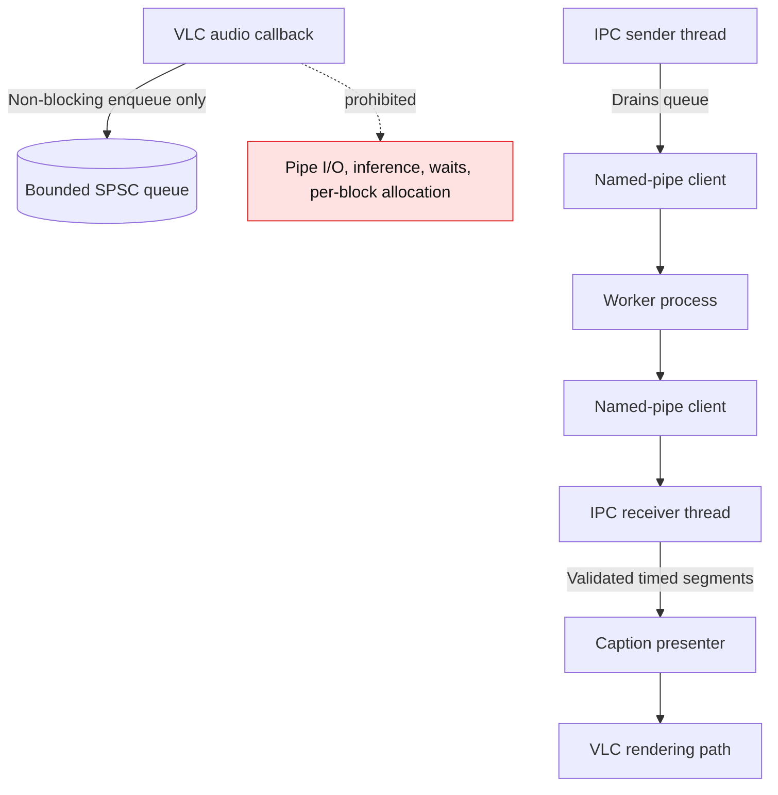
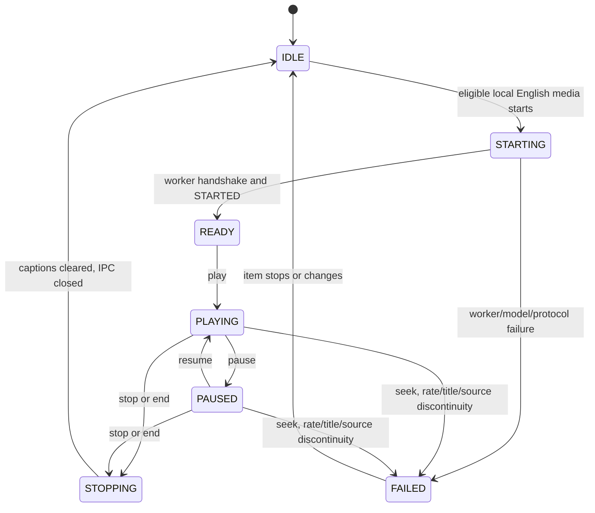
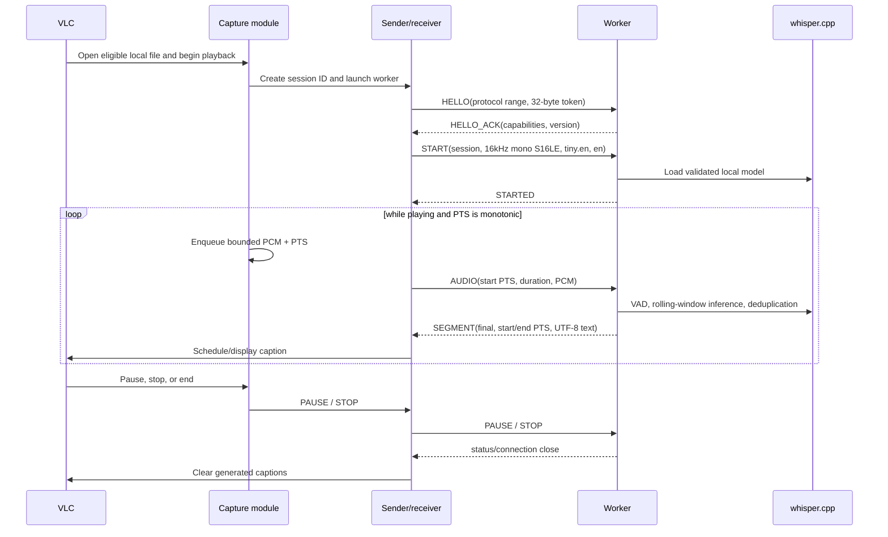
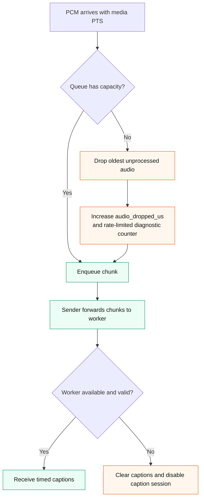
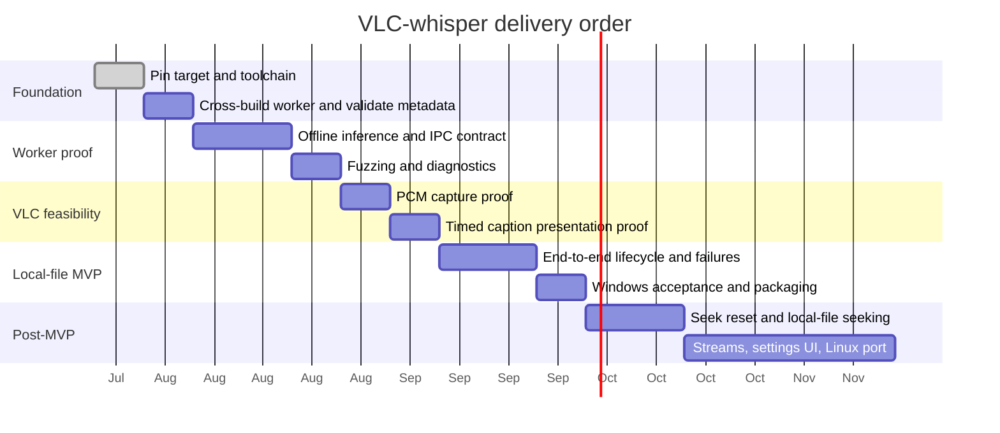
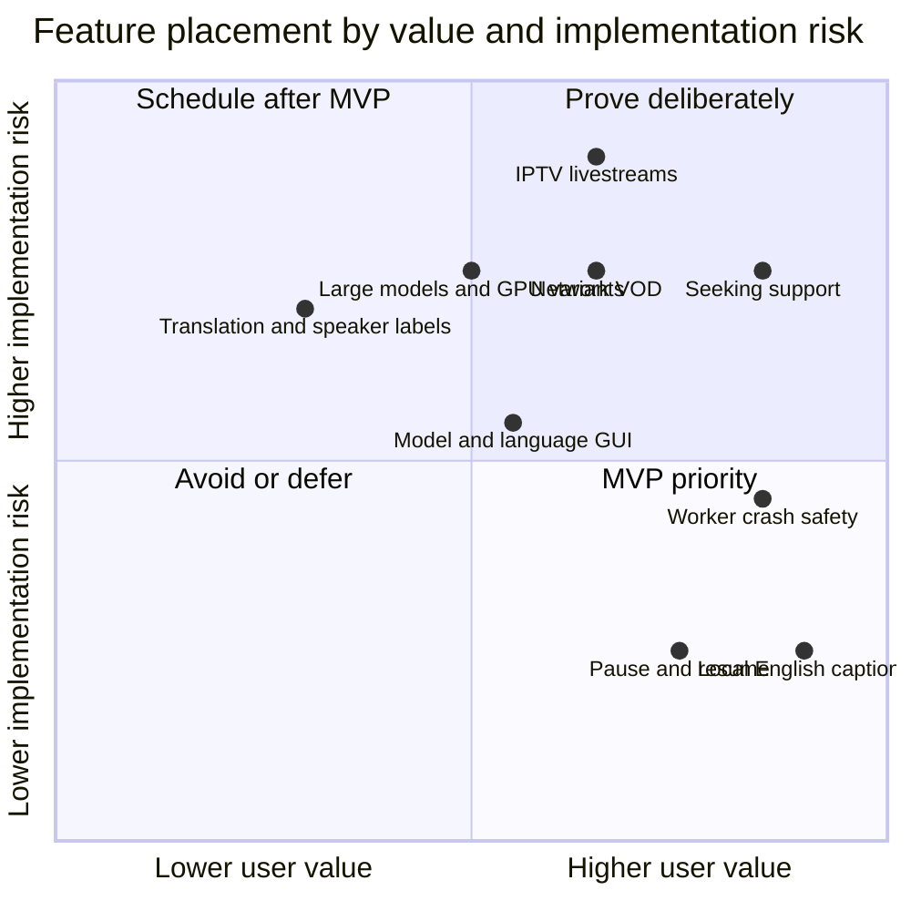

# VLC-whisper Diagrams

These diagrams are the visual companion to the accepted foundation. They are normative where they repeat an accepted decision in `architecture.md` or `decisions.md`; if a diagram and a contract disagree, the contract wins until the diagram is corrected.

## System context

```mermaid
flowchart LR
    U[User] -->|Opens and controls local video| V[VLC: pinned Windows build]
    V -->|Decoded PCM plus media PTS| C[Capture module: C]
    C --> Q[Bounded SPSC audio queue]
    Q --> S[IPC sender thread]
    S <-->|Authenticated local named pipe \n versioned binary protocol| W[vlc-whisper-worker.exe: C host]
    W --> H[whisper.cpp C API\npinned dependency]
    H --> M[(Local tiny.en model)]
    W -->|Timed final caption segments| R[IPC receiver and presenter: C]
    R -->|Timed subtitle or OSD path| V
    V -->|Captions over video| U

    classDef boundary fill:#fff4e5,stroke:#d97706,color:#111;
    classDef local fill:#ecfdf5,stroke:#059669,color:#111;
    class W,H,M local;
    class S,W,R boundary;
```



The user, VLC, plugin, worker, and model all remain on the same machine. There is no HTTP endpoint, cloud transcription service, telemetry destination, or TCP listener.

## Thread and ownership boundaries



**Invariant:** a captioning failure may remove captions, but it must not block, glitch, or crash VLC playback.

## Playback and caption state



For the MVP, `FAILED` means **caption session disabled for this item**. It never means VLC playback itself has failed.

## Session startup sequence



## Backpressure behavior



The queue is capped at 15 seconds of unprocessed audio in the initial design. Loss under overload is explicit and measurable; slowing playback is never an overload strategy.

## Protocol frame

```mermaid
block-beta
  columns 6
  block:header:6
    A[magic:32 bits] B[major:16 bits] C[type:16 bits] D[payload length:32 bits] E[sequence:64 bits]
  end
  F[Payload: schema depends on message type]:6
```

```text
magic: 0x564C4357 (VLCW)
maximum payload: 1,048,576 bytes
transport: Windows message-mode named pipe
Linux port: Unix-domain SOCK_SEQPACKET, same frame format
```

The receiver validates protocol version, token, session ID, sequence, payload bounds, UTF-8, and timestamp invariants before acting on a message.

## Delivery roadmap



Dates are illustrative sequencing anchors, not delivery commitments. The required gates are feasibility proof, bounded behavior, and Windows VLC end-to-end validation—not calendar completion.

## Feature scope map



This map is intentionally a prioritization aid, not a scientific measurement. It reinforces that the smallest useful MVP is local English captioning with reliable failure behavior, before source diversity or UI breadth.
