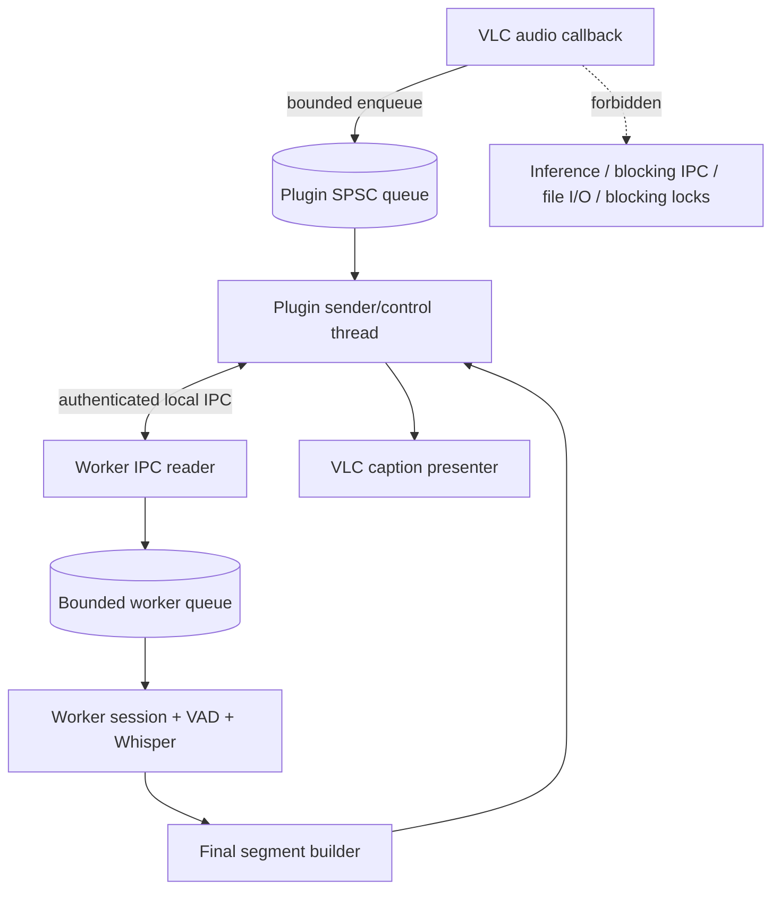
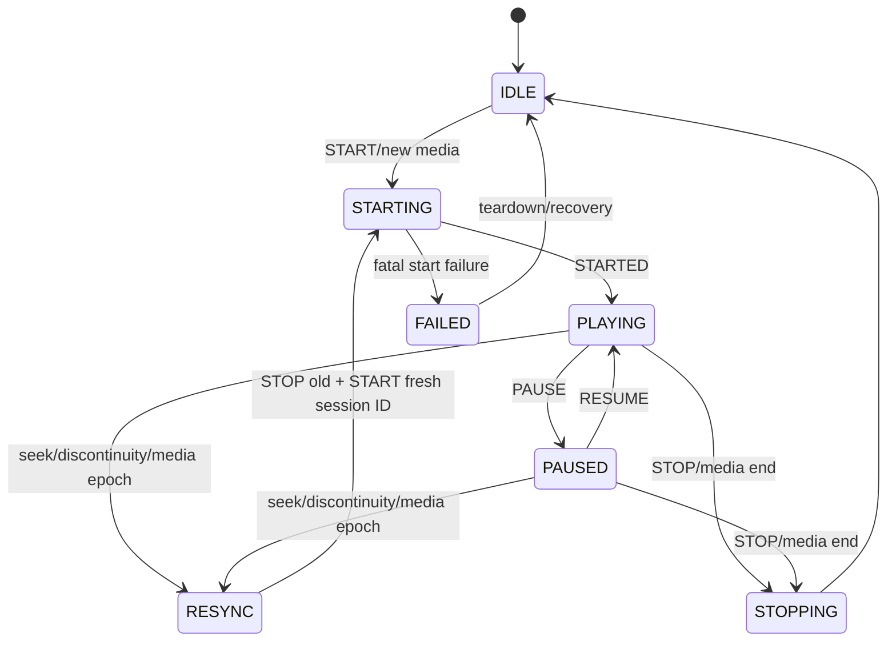
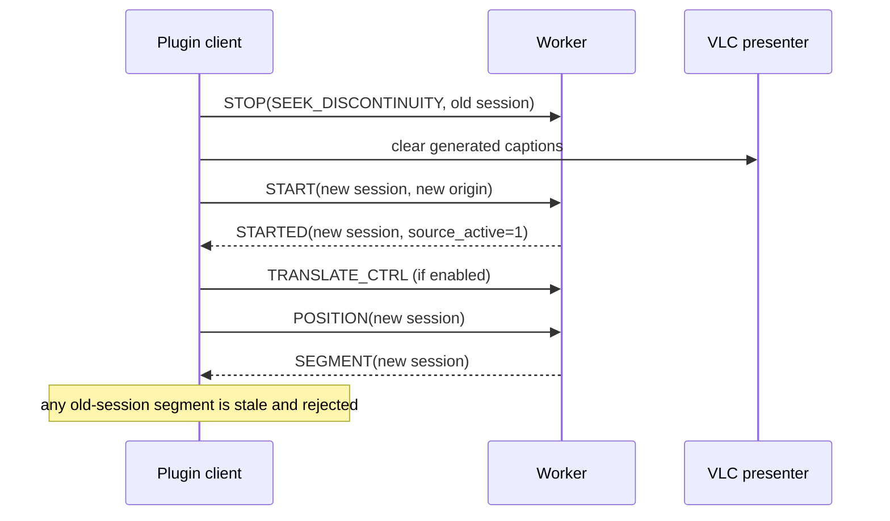
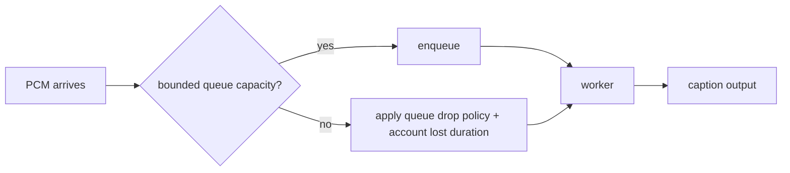

# VLC-Whisper Diagrams

Supplemental visuals only. `architecture.md`, `api-contracts.md`, and ADRs are authoritative when prose/diagrams disagree. The root README contains the primary system flow.

## Ownership boundary

## Caption-session lifecycle

## Source seek epoch

## Overload rule

Playback is never slowed to preserve caption completeness. Data loss must remain explicit in timeline/drop accounting.
