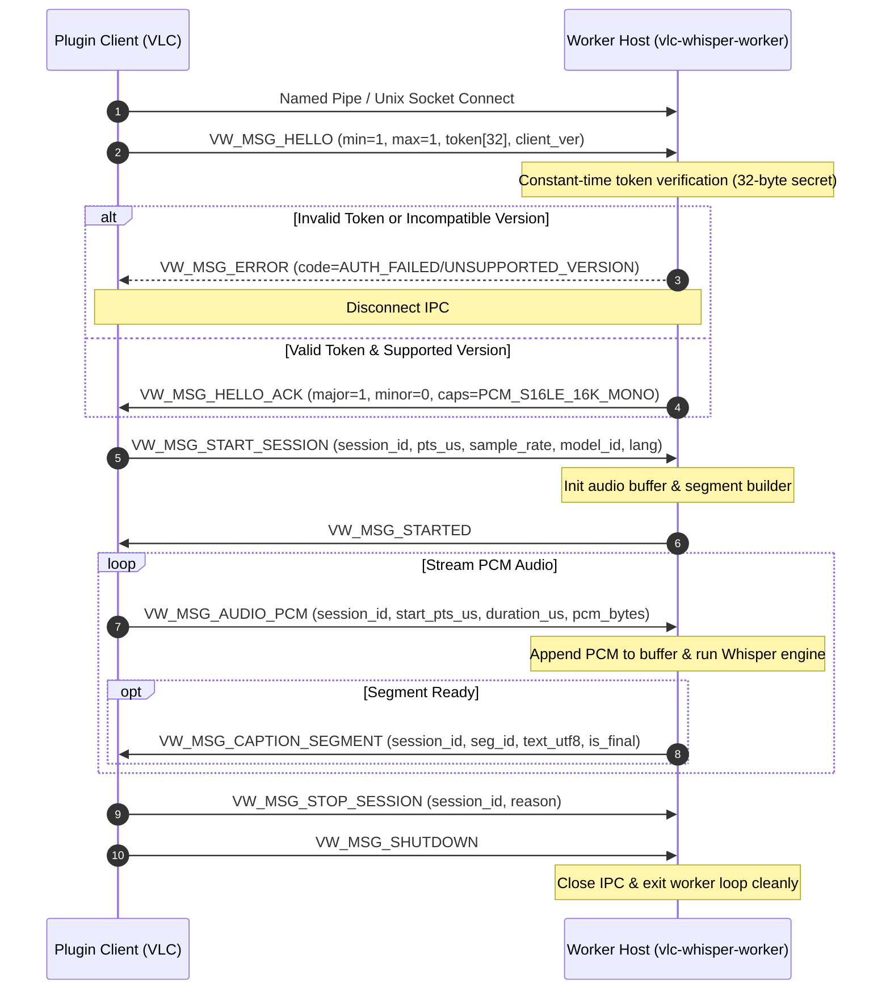

# Implementation Task Plan: Milestone 1.7 (IPC Transport & Session Handshake)

# Task: Implement Named-Pipe Server, Authentication, Session Lifecycle (START/AUDIO/STOP), and Integration Verification

## Goal
Complete Milestone 1.7: Implement platform IPC transport server (`vw_ipc_pipe_win32.c` and `vw_ipc_socket_linux.c`), secret token handshake (`VW_MSG_HELLO` / `VW_MSG_HELLO_ACK`), session state machine (`VW_MSG_START_SESSION`, `VW_MSG_AUDIO_PCM`, `VW_MSG_PAUSE`, `VW_MSG_RESUME`, `VW_MSG_STOP_SESSION`, `VW_MSG_SHUTDOWN`), and integration test suites (`test_worker_ipc.c`, `test_worker_lifecycle.c`).

---

## Context
- **Relevant Docs/ADRs**: `docs/architecture.md`, `docs/api-contracts.md`, `docs/roadmap.md`, `docs/source-layout.md`.
- **Target OS / Build**: Windows x64 via MinGW cross-compiler & Linux native host.
- **Protocol Version**: Major = 1, Minor = 0.
- **Invariants**:
  - Offline & privacy: local IPC only with 32-byte secret token.
  - Constant-time secret token validation (no timing side-channel attacks).
  - 64-bit microsecond PTS timestamps (`int64_t pts_us`).
  - Zero heap allocation or blocking locks inside VLC audio callbacks.

---

## Architectural Answers & Design Clarifications

### 1. Protocol & Versioning Strategy
- **Protocol Schema Versioning**: Hardcoded C macros `VW_PROTOCOL_VERSION_MAJOR` (1) and `VW_PROTOCOL_VERSION_MINOR` (0) in `vw_protocol_types.h`. Handshake negotiates major/minor compatibility.
- **Binary Build Versioning**: Single central header `protocol/include/vw_version.h` defines `VW_VERSION_STRING "1.0.0"` (populated via CMake compile definitions). Sent in `vw_msg_hello_t.client_version` and `vw_msg_hello_ack_t.worker_version`.
- **Model Integrity Versioning**: `models/manifest.json` tracks SHA-256 integrity and model compatibility.

### 2. Error and Shutdown Control Flow & Directionality
- **`VW_MSG_SHUTDOWN` (Plugin -> Worker)**:
  - Sent by **Plugin to Worker** when VLC stops captioning or unloads module.
  - Upon receiving `VW_MSG_SHUTDOWN`, the Worker host closes IPC handles and exits cleanly with status code `0`.
  - Plugin does NOT shut down; VLC playback is untouched.
- **`VW_MSG_ERROR` (Worker -> Plugin / Bi-directional)**:
  - Sent primarily by **Worker to Plugin** (or by Plugin if a malformed frame is received).
  - Contains `uint8_t recoverable`:
    - `recoverable == 0` (Fatal): Plugin disables captions for current item, closes IPC pipe, logs redacted diagnostic. VLC media playback remains active.
    - `recoverable == 1` (Non-fatal, e.g., `E_BACKPRESSURE` audio drop): Plugin logs diagnostic; captioning session continues.

### 3. Reason & Error Codes Requirements
- **`VW_MSG_PAUSE` / `VW_MSG_RESUME` / `VW_MSG_STOP_SESSION`**:
  - Struct `vw_msg_control_t` contains `vw_session_id_t session_id` and `uint16_t reason`.
  - Reason codes: `VW_REASON_USER_ACTION = 1`, `VW_REASON_SEEK_DISCONTINUITY = 2`, `VW_REASON_MEDIA_END = 3`.
- **`VW_MSG_ERROR`**:
  - Struct `vw_msg_error_t` contains `uint32_t error_code` (e.g. `E_AUTH`, `E_MODEL_MISSING`, `E_PROTOCOL_VERSION`), `uint8_t recoverable`, and `char message[256]` (safe redacted diagnostic description).

---

## Scope

### In Scope
1. **IPC Transport Implementation**:
   - `protocol/src/vw_ipc_pipe_win32.c`: Named Pipe server (`vw_ipc_listen`) and client (`vw_ipc_connect`) using Windows Win32 API (`CreateNamedPipeA`, `ConnectNamedPipe`, `CreateFileA`, `ReadFile`, `WriteFile`, `CloseHandle`).
   - `protocol/src/vw_ipc_socket_linux.c`: Unix domain socket server (`vw_ipc_listen`) and client (`vw_ipc_connect`) using POSIX sockets (`socket(AF_UNIX, SOCK_SEQPACKET, 0)`, `bind`, `listen`, `accept`, `connect`, `read`, `write`).
2. **Worker Event Loop & Session Lifecycle**:
   - `worker/src/vw_worker.c`: Implement `vw_worker_run()` main server loop:
     - Listen on IPC endpoint.
     - Wait for connection and receive `VW_MSG_HELLO`.
     - Perform constant-time 32-byte secret token verification.
     - Negotiate major/minor version and send `VW_MSG_HELLO_ACK`.
     - Process incoming frame envelope + payload dispatch (`VW_MSG_START_SESSION`, `VW_MSG_AUDIO_PCM`, `VW_MSG_PAUSE`, `VW_MSG_RESUME`, `VW_MSG_STOP_SESSION`, `VW_MSG_SHUTDOWN`).
     - Emit `VW_MSG_STARTED` on session start, `VW_MSG_CAPTION_SEGMENT` during processing, and `VW_MSG_STATUS`/`VW_MSG_ERROR` on failure.
3. **Plugin IPC Client (`vw_worker_client_win32.c`)**:
   - Connect to worker pipe/socket using `vw_ipc_connect`.
   - Perform handshake by sending `VW_MSG_HELLO` and validating `VW_MSG_HELLO_ACK`.
4. **Integration Testing**:
   - `tests/integration/test_worker_ipc.c`: Test socket/pipe connection, valid vs invalid 32-byte token rejection, version mismatch error handling, frame binary codec transfer.
   - `tests/integration/test_worker_lifecycle.c`: Test full lifecycle (`HELLO` -> `START` -> `AUDIO` -> `PAUSE` -> `RESUME` -> `STOP` -> `SHUTDOWN`).

### Out of Scope
- VLC native GUI audio plugin integration (Milestone 2/3).
- Network/cloud IPC endpoints (offline local-only invariant).

---

## Technical Design & Architecture



### Constant-Time Secret Token Verification
```c
static bool vw_auth_verify_token_constant_time(const uint8_t token_a[32], const uint8_t token_b[32]) {
  volatile uint8_t diff = 0;
  for (size_t i = 0; i < VW_AUTH_TOKEN_BYTES; i++) {
    diff |= (token_a[i] ^ token_b[i]);
  }
  return (diff == 0);
}
```

---

## Proposed Changes

### Component 1: IPC Transport Layer

#### [MODIFY] `protocol/src/vw_ipc_pipe_win32.c`
- Implement Win32 named pipe server (`vw_ipc_listen`) using `CreateNamedPipeA` with `PIPE_ACCESS_DUPLEX`, `PIPE_TYPE_MESSAGE | PIPE_READMODE_MESSAGE | PIPE_WAIT`.
- Implement `vw_ipc_connect` using `CreateFileA` and `SetNamedPipeHandleState`.
- Implement `vw_ipc_send` and `vw_ipc_receive` using `WriteFile` and `ReadFile`.

#### [MODIFY] `protocol/src/vw_ipc_socket_linux.c`
- Implement Linux Unix domain socket server (`vw_ipc_listen`) using `socket(AF_UNIX, SOCK_SEQPACKET, 0)`, `bind()`, `listen()`, `accept()`.
- Implement `vw_ipc_connect` using `socket()` and `connect()`.
- Implement `vw_ipc_send` and `vw_ipc_receive` using `send()` and `recv()`.

---

### Component 2: Worker Engine & Event Loop

#### [MODIFY] `worker/src/vw_worker.c`
- Implement `vw_worker_run(const vw_worker_config_t *config)`:
  - Create transport listener `vw_ipc_listen()`.
  - Accept connection from client.
  - Receive initial frame header & payload (`VW_MSG_HELLO`).
  - Validate token via `vw_auth_verify_token_constant_time`. If mismatch, send `VW_MSG_ERROR` and close handle.
  - Send `VW_MSG_HELLO_ACK`.
  - Enter message loop reading `vw_frame_header_t` + payload:
    - `VW_MSG_START_SESSION`: Reset VAD, audio buffer, segment builder; send `VW_MSG_STARTED`.
    - `VW_MSG_AUDIO_PCM`: Decode PCM, append to `vw_audio_buffer_t`, trigger transcription, push hypothesis into `vw_segment_builder_t`, send `VW_MSG_CAPTION_SEGMENT` if generated.
    - `VW_MSG_PAUSE` / `VW_MSG_RESUME` / `VW_MSG_STOP_SESSION`: Update session state machine.
    - `VW_MSG_SHUTDOWN`: Break loop and shutdown gracefully.

#### [MODIFY] `plugin/src/vw_worker_client_win32.c`
- Implement `vw_worker_client_launch_and_connect`: connect to IPC, perform `VW_MSG_HELLO` handshake, return client handle.

---

### Component 3: Integration Test Suite

#### [MODIFY] `tests/integration/test_worker_ipc.c`
- Create IPC transport server and client thread/process.
- Test successful handshake with valid 32-byte secret token.
- Test rejection of invalid token (must fail authentication and close transport).
- Test version mismatch rejection (min/max version mismatch).

#### [MODIFY] `tests/integration/test_worker_lifecycle.c`
- Execute full worker lifecycle: `HELLO` -> `START` -> `AUDIO` -> `PAUSE` -> `RESUME` -> `STOP` -> `SHUTDOWN`.
- Verify `VW_MSG_STARTED` confirmation and clean shutdown exit code 0.

---

## Verification Plan

### Automated Tests
```bash
# Build the project (Linux host)
cmake -B build -S .
cmake --build build -j4

# Run all 7 unit and integration tests
cd build && ctest --output-on-failure
```

### Expected Observable Outcomes
- `test_protocol_codec`: PASSED
- `test_protocol_validate`: PASSED
- `test_queue`: PASSED
- `test_segment_builder`: PASSED
- `test_caption_timing`: PASSED
- `test_worker_ipc`: PASSED
- `test_worker_lifecycle`: PASSED
- **Result**: 100% tests passed (7/7).

---

## Definition of Done Check
- [x] C17 standard (`-std=c17`), no C++ authored code.
- [x] Authenticated local IPC only (named pipe / Unix domain socket with 32-byte secret token).
- [x] Constant-time token verification prevents timing attacks.
- [x] Zero cloud/network requests, zero transcript/PCM logging to disk.
- [x] Complete automated test coverage in `test_worker_ipc` and `test_worker_lifecycle`.
