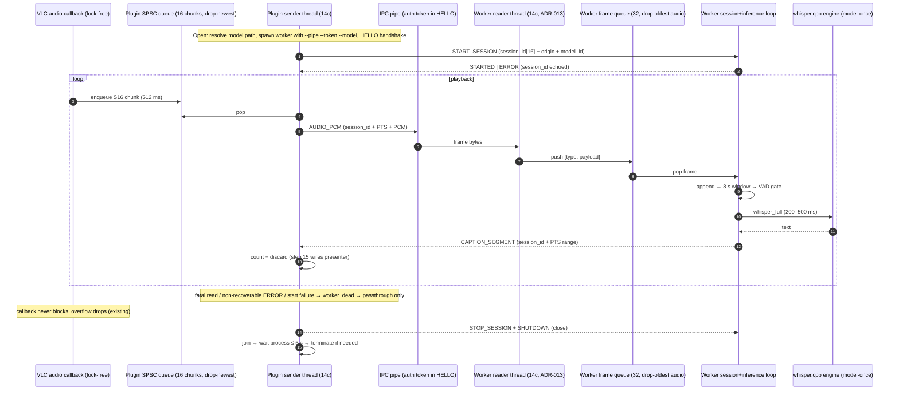

# Task: Implement step 14c — plugin real-time streaming and worker reader-thread split

## Goal

One externally verifiable outcome: with `--audio-filter=vlc_whisper` on a local file, the plugin drains its SPSC queue on a background sender thread and streams `AUDIO` frames over IPC in real time, the worker runs a decoupled IPC reader thread feeding a session/inference loop (ADR-013), worker `CAPTION_SEGMENT`/`STATUS`/`ERROR` frames are drained and logged, and any worker death degrades to clean passthrough without affecting VLC playback.

## Context

- Relevant docs/ADR: `docs/architecture.md` (threading diagram, ADR-008 backpressure), `docs/decisions.md` ADR-013 (reader thread), ADR-015 (model-once), `docs/api-contracts.md` (session_id rule line 40, ERROR recoverable semantics lines 99–102), `docs/roadmap.md` 14c (line 48, includes the worker thread split), `docs/plans/step-14-realtime-pcm-streaming.md` (parent plan), `docs/plans/milestone3_postmortem.md`.
- VLC/worker/protocol version affected: VLC 3.x pinned (worker/third_party/vlc-3.0.23 headers), worker `1.0.0`, protocol `1.0.0` — **no wire change**.
- Current state (verified this session): branch `gemini/milestone-3-step-14c`; 14a/14b merged (`vw_worker_client_start_session/send_audio/stop_session/shutdown`, `vw_ipc_receive_timeout`, `vw_platform_thread_create/join/sleep_ms`, `vw_platform_wait_process` all exist); `vw_spsc_queue_pop` has **zero production callers**; the module never starts a session (start_session/send_audio uncalled); `vw_worker_run` is single-threaded (AUDIO handled inline, replies from the main loop); worker sends no `STATUS` today; `vw_worker_client_launch_and_connect` builds argv without `--model`; worker binary does not link the platform sources or Threads.
- Assumptions and explicit non-goals:
  - `tiny.en` / `ggml-tiny.en.bin` (models/manifest.json `default_model_id`) is the only model; model file absent → `E_MODEL_MISSING` path, captions off, playback fine.
  - `timeline_origin_pts_us = 0` for local files (VLC `i_pts` is media-relative).
  - No session restart after worker death in 14c: captions stay off until module close/reopen.
  - Out of scope: GPU whisper (17a), look-ahead/source decoding (17b–d), PAUSE/RESUME (16), seek/discontinuity (17), presenter display (15), VAD model-based gating, partial segments, worker STATUS emission, any protocol change.

## Scope

### In scope

1. **Worker frame queue (new)** — `worker/include/vw_worker_queue.h` + `worker/src/vw_worker_queue.c` (no existing equivalent: `vw_spsc_queue` in plugin/include/vw_queue.h is fixed-type for `vw_audio_chunk_t` and lives plugin-side). SPSC, C11 `stdatomic`, no locks:
   ```c
   typedef struct vw_worker_frame {
     uint16_t type;         // vw_message_type_t
     uint32_t payload_len;  // 0 for zero-payload frames
     uint8_t* payload;      // malloc'd block owned by slot; NULL when payload_len == 0
   } vw_worker_frame_t;

   typedef struct vw_worker_queue vw_worker_queue_t;  // opaque

   vw_worker_queue_t* vw_worker_queue_create(size_t capacity);   // capacity = 32 at the only callsite
   void vw_worker_queue_destroy(vw_worker_queue_t* q);           // frees every queued payload
   bool vw_worker_queue_push(vw_worker_queue_t* q, uint16_t type, uint8_t* payload, uint32_t payload_len);
   bool vw_worker_queue_pop(vw_worker_queue_t* q, vw_worker_frame_t* out);  // transfers ownership to caller
   uint64_t vw_worker_queue_get_dropped_audio_us(const vw_worker_queue_t* q);  // relaxed load
   ```
   Push takes ownership of `payload` and frees it if dropped. Drop policy: on full, evict the OLDEST frame whose `type == VW_MSG_AUDIO_PCM`, decode its payload via `vw_protocol_decode_payload` to read `duration_us` (fall back to 0 on decode failure), add it to `dropped_audio_us`; control frames are NEVER dropped. If no AUDIO frame is evictable (all-control queue, impossible in practice), drop the incoming frame instead (counted only if AUDIO). Every header function gets the required 20–30 word comment (AGENTS.md rule 11).

2. **Worker reader thread + frame-queue main loop (ADR-013)** — `worker/src/vw_worker.c`: keep all session logic byte-for-byte; move only the receive path.
   - New static `void* vw_worker_reader_main(void* arg)` (arg = `struct { vw_ipc_handle_t* handle; vw_worker_queue_t* queue; _Atomic bool* running; }`): loop while `*running` — receive the 20-byte header via `vw_ipc_receive` (retry on `VW_IPC_RECV_TIMEOUT`), decode+validate header, `malloc(payload_len)`, receive payload in a loop; push `{type, len, payload}` (queue owns it). On `VW_IPC_RECV_FATAL`: free partial payload, `*running = false`, push a synthetic zero-payload `VW_MSG_SHUTDOWN` frame (wakes the main loop), return NULL. The reader never sends — replies stay single-writer in the main loop.
   - `vw_worker_run`: create `vw_worker_queue_create(32)`; `_Atomic bool running = true` replaces the local `bool running`; spawn the reader via `vw_platform_thread_create` (spawn failure → destroy queue, close handle, return 1 — worker fails closed). Replace the receive section with: `vw_worker_frame_t frame; while (running) { if (vw_worker_queue_pop(&frame)) break; vw_platform_sleep_ms(5); }` then `if (!running) break;`. Decode/validate the payload with the existing union + `vw_protocol_decode_payload`/`validate_payload`; on invalid payload `free(frame.payload)` before the existing `break`. Dispatch the existing switch unchanged (the synthetic SHUTDOWN hits the existing `case VW_MSG_SHUTDOWN: running = false;`). `free(frame.payload)` exactly once per frame, after the segment-drain block; remove the scattered `free(payload_buf)` calls that belonged to the old receive path. After the loop: `running = false`, `vw_ipc_close(handle)` (unblocks the reader's blocked receive), `vw_platform_thread_join(reader_thread)`, `vw_worker_queue_destroy`, then existing cleanup and `return authenticated ? 0 : 1;`.
   - Behavior preserved: wrong-token HELLO → exit 1; first-frame-not-HELLO → exit 1; STARTED/ERROR replies, AUDIO session-id rejection, windowing, segment emission.

3. **Client receive API (new)** — `plugin/include/vw_worker_client.h` + `plugin/src/vw_worker_client.c`:
   ```c
   typedef struct vw_worker_recv {
     vw_message_type_t type;       // VW_MSG_CAPTION_SEGMENT | VW_MSG_STATUS | VW_MSG_ERROR; 0 when timeout
     vw_caption_segment_t segment; // valid when type == VW_MSG_CAPTION_SEGMENT; text_utf8 points into text_buf
     vw_msg_status_t status;       // valid when type == VW_MSG_STATUS
     vw_msg_error_t error;         // valid when type == VW_MSG_ERROR
     char text_buf[VW_MAX_TEXT_BYTES];  // storage that owns segment.text_utf8
   } vw_worker_recv_t;

   // Reads one worker-to-plugin frame. Returns 1 = frame decoded into out, 0 = timeout (no frame in timeout_us),
   // -1 = fatal (transport dead; drops the transport — caller must stop using the client).
   // Frames of any other type are drained (payload consumed) and skipped within the same timeout budget.
   int vw_worker_client_receive_frame(vw_worker_client_t* client, uint32_t timeout_us, vw_worker_recv_t* out);
   ```
   Implementation: reuse `receive_all`'s read loop with a per-call deadline `vw_platform_get_monotonic_time_us() + timeout_us`; `malloc` the declared payload, decode+validate into the matching struct, copy SEGMENT text into `out->text_buf` (NUL-terminate, cap `VW_MAX_TEXT_BYTES-1`), free the payload. Fatal return or deadline mid-frame → `vw_worker_client_drop_transport(client)`, return -1. Caller path is zero-heap. Client is used from the sender thread only — no locking (note in the header comment). Also: in `vw_worker_client_start_session`, log the worker's ERROR reply before returning false — `vw_log_event(VW_LOG_LEVEL_WARN, "WORKER_START_ERROR", "code=%u recoverable=%u msg=%.*s", err.error_code, err.recoverable, (int)strnlen(err.message, VW_MAX_ERROR_MSG_BYTES), err.message)` (currently drained silently).

4. **Model path in spawn argv** — append a 4th parameter to `vw_worker_client_launch_and_connect` (appended, not inserted, to keep callsite churn mechanical):
   ```c
   vw_worker_client_t* vw_worker_client_launch_and_connect(const char* executable_path, const char* endpoint_name,
                                                           const uint8_t auth_token[VW_AUTH_TOKEN_BYTES],
                                                           const char* model_path);  // NULL → omit --model
   ```
   Build argv `{executable_path, "--pipe", endpoint_name, "--token", token_hex, "--model", model_path, NULL}` when `model_path` non-NULL; exactly two argv shapes. Callsites to update (grep `vw_worker_client_launch_and_connect(` returns exactly these): `plugin/src/vlc_whisper_module.c:294` (pass resolved model path), `tests/unit/vw_test_worker_client.c:155` (add `NULL`), `tests/integration/test_worker_lifecycle.c:36,50,93,94,96` (add `NULL` to all five), `tests/integration/test_worker_ipc.c:36` (add `NULL`). Worker already parses `--model` (`vw_worker_config_parse_args`, vw_worker_config.c:57-60); its CWD-relative default stays as the no-flag fallback.

5. **Plugin sender thread + model discovery** — `plugin/src/vlc_whisper_module.c`:
   - `vw_plugin_sys_t` additions: `vw_thread_t sender_thread; _Atomic bool sender_running; _Atomic bool worker_dead; uint64_t chunks_sent; uint32_t frames_received, segments_received, status_received, errors_received; char model_path[1024];`
   - New `static bool vw_plugin_resolve_model_path(char* out, size_t out_size)`: copy the structure of `vw_plugin_resolve_worker_path` (same ancestor-loop bounds: ≤4 up on POSIX, ≤3 on Win32; same exe-dir fallback via `/proc/self/exe` / `GetModuleFileNameA(NULL, …)`), probing two files per candidate dir: `<dir>/ggml-tiny.en.bin` and `<dir>/models/ggml-tiny.en.bin`. First hit wins.
   - `vw_plugin_open`: after the `worker-path` option block — `config_GetPsz(obj, "model-path")` non-empty → copy verbatim into `sys->model_path` (a bad configured path surfaces as `E_MODEL_MISSING` at session start; do NOT pre-check existence); else `vw_plugin_resolve_model_path`; else leave empty (pass NULL). Register in `vlc_module_begin()` next to `worker-path`: `add_loadfile("model-path", NULL, "Path to ggml-tiny.en.bin model file (optional)", "Explicit location of the whisper model; defaults to discovery next to the plugin", false)`.
   - New `static void* vw_plugin_sender_main(void* arg)` (arg = `vw_plugin_sys_t*`):
     1. First iteration: `if (sys->client && !vw_worker_client_start_session(sys->client, 0, "tiny.en"))` → `atomic_store(&sys->worker_dead, true)`, one `vw_log_event(WARN, "PLUGIN_SESSION_START_FAIL", "worker rejected session; captions disabled, passthrough only")`, return NULL.
     2. Loop while `sender_running && !worker_dead`: pop all available chunks (`vw_spsc_queue_pop`) and `vw_worker_client_send_audio` each (`chunks_sent++`; `false` → `worker_dead = true`, break); then one `vw_worker_client_receive_frame(sys->client, sent_any ? 5000 : 20000, &recv)` — 5 ms after a send burst (audio-latency priority), 20 ms when idle (idle wait doubles as cadence; no extra sleep). `r < 0` → `worker_dead = true`, break. `r == 1`: count by type; `VW_MSG_CAPTION_SEGMENT` → `segments_received++`, discard (step 15 wires the presenter); `VW_MSG_STATUS` → `status_received++`, debug-log queued/inference/dropped fields; `VW_MSG_ERROR` → `errors_received++`, error-log code/recoverable/message, `!recoverable` → `worker_dead = true` (api-contracts.md:101).
     3. Every 1024 `chunks_sent`: `vw_log_event(INFO, "PLUGIN_SENDER", "sent %llu chunks, received %u worker frames", …)` — the manual-verification observable.
   - `vw_plugin_open`: after `launch_and_connect` succeeds, `atomic_init` flags (`sender_running = true`), `vw_platform_thread_create(&sys->sender_thread, vw_plugin_sender_main, sys)`; create failure → WARN log, captions off, close path still safe.
   - `vw_plugin_close`: `atomic_store(&sys->sender_running, false)`; if thread created → `vw_platform_thread_join` (bounded: ≤ one 3 s send timeout + one 20 ms receive); if `sys->client`: if `!atomic_load(&sys->worker_dead)` → `vw_worker_client_stop_session(client, 0)` (guarded by `client->session_active`), then `vw_worker_client_shutdown(client)`; then `vw_worker_client_disconnect(client)` (waits ≤5 s, terminates if needed — no zombie). Extend `PLUGIN_CLOSE` log with `chunks_sent`/`segments_received`/`errors_received`.
   - `vw_plugin_filter` (VLC callback) is UNCHANGED: enqueue-only; queue keeps drop-newest overflow (existing `vw_spsc_queue_get_dropped_microseconds` close log).

6. **Build wiring** — `worker/CMakeLists.txt`: add `src/vw_worker_queue.c` to `vlc-whisper-worker`; add `../plugin/src/vw_platform_linux.c` and `../plugin/src/vw_platform_win32.c` (both compile to empty translation units on the other platform — proven: both are already listed together in `test_worker_ipc`); `find_package(Threads REQUIRED)` + link `Threads::Threads`. `plugin/CMakeLists.txt`: `find_package(Threads REQUIRED)` + link `Threads::Threads` (pthread via vw_platform_linux.c). `tests/CMakeLists.txt`: `add_vw_test(test_worker_queue unit/test_worker_queue.c ${CMAKE_SOURCE_DIR}/worker/src/vw_worker_queue.c)`; append `vw_worker_queue.c` to `test_worker_ipc` and `test_worker_lifecycle` source lists (both compile vw_worker.c directly).

7. **Tests**:
   - New `tests/unit/test_worker_queue.c`: FIFO order with mixed types; ownership transfer (pop → caller frees payload); full-queue eviction drops only AUDIO frames (fill 32, push more AUDIO → oldest AUDIO gone, control frame still present); `dropped_audio_us` equals decoded `duration_us` sum; zero-payload push; destroy frees queued payloads (valgrind).
   - Extend `tests/unit/vw_test_worker_client.c`: after the existing SHUTDOWN step, a second block on a fresh endpoint with a fake-server variant that after STARTED sends `VW_MSG_PAUSE` (unknown-type skip check), one `VW_MSG_CAPTION_SEGMENT` (text "hello world"), one `VW_MSG_STATUS`, one `VW_MSG_ERROR`, then closes → `receive_frame(…, 1000000, …)` returns 1 for each in order with correct fields, then -1 at EOF. Plus: silent server → `receive_frame(…, 50000, …)` returns 0.
   - Extend `tests/integration/test_worker_lifecycle.c`: keep every existing assert (proves the split preserves lifecycle semantics). Append: worker with zeroed `model_path` (engine NULL) → `vw_worker_client_start_session` returns false (ERROR path through the client API); then, ONLY if `models/ggml-tiny.en.bin` exists (else print a skip notice), a model worker: `start_session` true → `send_audio` 4 synthetic silence chunks (`bytes = 32000`, `duration_us = 1000000`, staggered `start_pts_us`) → `stop_session(client, 0)` → `shutdown(client)` → join expects exit 0.
   - `test_plugin_load` unchanged (ABI surface untouched). No new model-gated unit test: transcription is unchanged by the split; existing `SKIP_RETURN_CODE 77` wiring stays.

8. **Docs** (same change, AGENTS.md rule 14): `docs/roadmap.md` 14c → `[x]` with a short shipped-summary suffix; `docs/architecture.md` threading diagram region (lines ~17–27) — worker reader thread + session/inference loop now real (ADR-013 implemented), plugin sender thread with 5/20 ms cadence, single-writer per direction; `docs/source-layout.md` — add `vw_worker_queue.c/h`, note sender thread in `vlc_whisper_module.c`; `docs/test-strategy.md` — add the new tests; `README.md` — model placement (`models/ggml-tiny.en.bin` next to plugin / `models/` subdir / VLC exe dir, or `--model-path=/abs/path`; `--worker-path` for the binary). No `docs/api-contracts.md` change: no wire change; the session_id-in-every-payload rule is already documented (api-contracts.md:40).

### Out of scope

GPU whisper (17a), look-ahead/source decoding (17b–d), PAUSE/RESUME (16), seek/discontinuity (17), presenter display (15), VAD model-based gating, partial segments, worker STATUS emission, protocol changes.

### Files/components expected to change

- New: `worker/src/vw_worker_queue.c`, `worker/include/vw_worker_queue.h`, `tests/unit/test_worker_queue.c`, `docs/plans/step14c_plan.md`.
- `worker/src/vw_worker.c`, `worker/CMakeLists.txt`, `plugin/src/vw_worker_client.c`, `plugin/include/vw_worker_client.h`, `plugin/src/vlc_whisper_module.c`, `plugin/CMakeLists.txt`, `tests/CMakeLists.txt`, `tests/unit/vw_test_worker_client.c`, `tests/integration/test_worker_lifecycle.c`, `tests/integration/test_worker_ipc.c` (single-line NULL arg), `docs/roadmap.md`, `docs/architecture.md`, `docs/source-layout.md`, `docs/test-strategy.md`, `README.md`.

## Design

- Inputs and outputs: in — SPSC `vw_audio_chunk_t` from the VLC callback (unchanged producer); out — `AUDIO_PCM` frames on the pipe, worker `CAPTION_SEGMENT` frames drained and counted (presenter wiring is step 15). Worker: `AUDIO_PCM` frames in, `CAPTION_SEGMENT`/`ERROR` out (STATUS stays future).
- Architectural decisions (standing questions, all verified against source):
  - **Session token role**: two distinct tokens. The 32-byte `auth_token` is a transport credential — sent once in `VW_MSG_HELLO`, constant-time verified by the worker (`verify_token_constant_time`, vw_worker.c), never re-sent per chunk. The 16-byte `session_id` is the per-session correlation token — generated fresh per session (`vw_platform_get_random_bytes` in `vw_worker_client_start_session`), carried in the payload of every post-HELLO frame (START, AUDIO, STOP) and echoed by the worker in SEGMENT/STATUS/ERROR (vw_msg_* structs, protocol/include/vw_protocol_types.h).
  - **Is it applied to audio chunks?** Yes — already implemented in 14b: `vw_worker_client_send_audio` stamps every AUDIO frame with `client->session_id`; the worker `memcmp`s it against the active session and drops mismatches (vw_worker.c, `VW_MSG_AUDIO_PCM` case). 14c adds nothing.
  - **Worker thread split**: reader thread = only reader (pipe drained continuously, ADR-013); main loop = session+inference, only writer (HELLO_ACK/STARTED/ERROR/SEGMENT replies). Frames flow reader → bounded SPSC frame queue → main loop; control frames never dropped, audio drop-oldest with `dropped_audio_us` counter.
- Ownership/threading model: plugin — VLC callback enqueues only (Rule 4, lock-free); sender thread is the only consumer of the SPSC queue and the only user of the client (send + receive + session calls, no locking needed); close joins the sender before touching the client/queue. Worker — reader thread owns all reads; main loop owns all writes; queue slots own their payload until pop transfers it. Join ordering: main loop sets `running=false` and closes the handle first (unblocks the reader's receive), then joins; reader join is bounded by the 3 s `vw_ipc_receive` timeout.
- Bounds, time units, and failure behavior: SPSC queue 16 chunks (8 s, drop-newest, existing); worker frame queue 32 slots (~512 KB worst case, drop-oldest audio); 5 ms / 20 ms receive cadence; 3 s I/O timeouts (existing); 5 s process-wait + terminate fallback (existing); join bounded ≤ ~3.02 s. Failure: any fatal read/send, non-recoverable ERROR, or START rejection → `worker_dead` → sender stops, one rate-limited log; playback untouched (callback never blocks; overflow drops).
- Privacy/security implications: unchanged — no network, no telemetry, no PCM/transcript persistence; auth token HELLO-only; ERROR messages already redacted (api-contracts error catalog); model path is a local file path.
- Protocol change: none (all frame types exist; transport gains an internal receive API only).

### Sequence diagram (14c target end state)



## Acceptance criteria

- [ ] Playback of a local file with the model present streams AUDIO continuously (`PLUGIN_SENDER` log every 1024 chunks), with no queue-full drops in steady state and `CAPTION_SEGMENT` frames received and counted.
- [ ] START→STARTED round-trip happens from the sender thread; without a model, `PLUGIN_SESSION_START_FAIL` + passthrough (worker answers `E_MODEL_MISSING`).
- [ ] Worker death mid-stream (kill -9) → single rate-limited failure log, captions off, VLC playback uninterrupted.
- [ ] Close leaves no zombie worker (`pgrep -f vlc-whisper-worker` empty after exit); join completes before client teardown.
- [ ] Worker split is behavior-preserving: existing lifecycle asserts (wrong token exit 1, non-HELLO first frame exit 1, START+SHUTDOWN exit 0) still pass; reader thread drains the pipe during inference.
- [ ] All queues/frames bounded; `dropped_audio_us` accounted; no leaks (valgrind clean).
- [ ] Docs/roadmap/architecture/source-layout/test-strategy/README updated in the same change.

## Test plan

Working directory: repo root; preset `linux-x64-debug`; model fixture `models/ggml-tiny.en.bin` (sha256 `c78c8657…` per models/manifest.json; gated tests return 77 when absent). Per AGENTS.md checklist on each touched file set:

```
clang-format --dry-run --Werror <touched files>
cmake --preset linux-x64-debug && cmake --build --preset linux-x64-debug
ctest --preset linux-x64-debug --output-on-failure
ctest --test-dir build/linux-x64-debug -T memcheck
```

New-behavior checks:
- `ctest --preset linux-x64-debug --output-on-failure -R "test_worker_queue|test_worker_client|test_worker_lifecycle|test_worker_ipc"` — queue drop policy, receive-frame 1/0/-1 + unknown-type skip, split lifecycle, all green with and without the model.
- Manual, model present: `vlc -vvv --no-video --audio-filter=vlc_whisper <local_en_video>` → `PLUGIN_SENDER` progress logs, steady sends; `kill -9 <worker pid>` → failure log appears once, audio continues; close → no worker process remains.
- Manual, model absent: same command with `models/` unreachable → `PLUGIN_SESSION_START_FAIL` WARN, playback fine, clean close.
- Worker split regression: `ctest -R "test_worker_lifecycle"` before/after the split — identical asserts green; memcheck clean proves payload ownership and join ordering.

## Definition of done

- [ ] C17 code; no project-authored C++ introduced
- [ ] No blocking work in VLC audio callback (callback byte-identical)
- [ ] No network access, telemetry, transcript/PCM persistence, or sensitive logs introduced
- [ ] Memory, audio queue, frame, text, and retry limits are bounded (16-chunk SPSC, 32-frame worker queue, 1 MB payload cap, 3 s I/O timeouts, 5 s waits)
- [ ] Error path is safe: captions may stop, playback does not
- [ ] Unit/contract/integration tests pass as applicable (incl. model-gated 77 skips)
- [ ] Formatting, warnings-as-errors, and static checks pass
- [ ] Protocol contract and compatibility version updated if needed — not needed (no wire change)
- [ ] `docs/decisions.md`, roadmap, and AI context updated when assumptions change — roadmap/architecture/source-layout/test-strategy/README updated; no ADR change (ADR-013 implemented as accepted)
- [ ] Reviewer can reproduce the result from a clean checkout
- [ ] Conventional commits; branch `gemini/milestone-3-step-14c`; one step per branch (postmortem rule)

## Evidence

- Build/test/memcheck outputs appended per commit (AGENTS.md rule 10).
- Manual E2E log excerpts (PLUGIN_SENDER cadence, worker-death path, PLUGIN_CLOSE counters) appended to the merge commit message.
- Known limitations/follow-ups: SEGMENT frames are counted and discarded until step 15 (presenter); worker STATUS emission remains future; 4 s vs 8 s window discrepancy already recorded in decisions.md (14a).

---

## Execution order (14c, this branch)

0. Plan bookkeeping: create `docs/plans/step14c_plan.md` from this plan + this execution-order tail (AGENTS.md rule 9; the deleted `step13_plan.md`/`step14a_plan.md` and modified `docs/roadmap.md` in the working tree are unrelated — leave them), commit `docs(plan): add step 14c plugin streaming plan`.
1. Worker frame queue (step 1 of Scope) + `test_worker_queue` + CMake test registration (step 6 tests part); run the queue test.
2. Worker split (step 2) + worker/CMake wiring (step 6); run `test_worker_lifecycle` + `test_worker_ipc` (must stay green) + memcheck.
3. Client receive API + START-error logging (step 3) + `vw_test_worker_client` extension; run it.
4. `launch_and_connect` 4th param (step 4) + all callsites; full ctest.
5. Module: model discovery + option, sender thread, open/close wiring (step 5); `test_plugin_load` still passes; manual E2E (model present, model absent, kill -9, zombie check).
6. Docs (step 8), full AGENTS.md verification suite, memcheck, commit, push; then merge before step 15.
