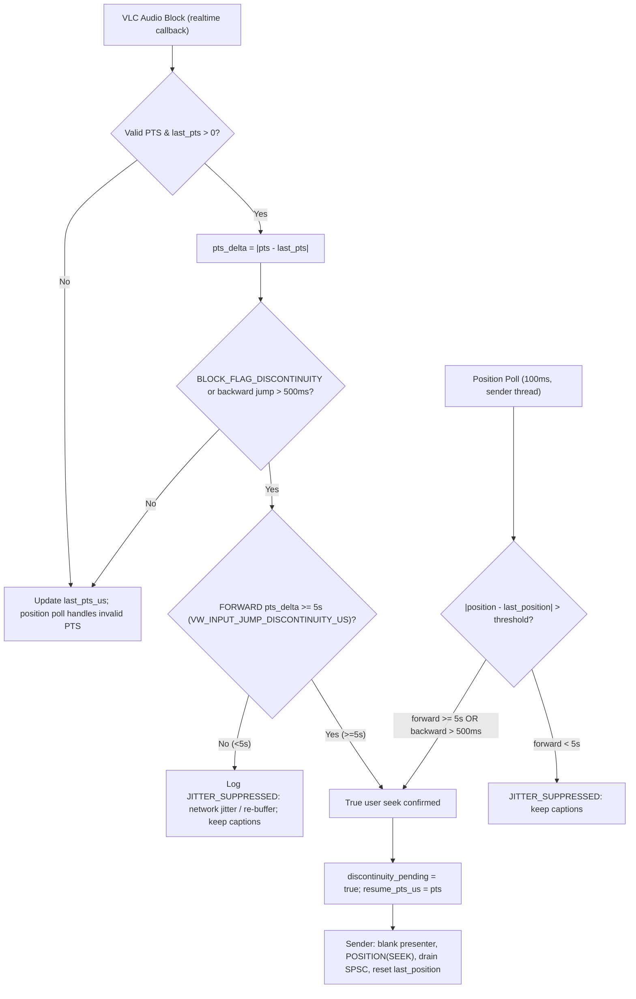
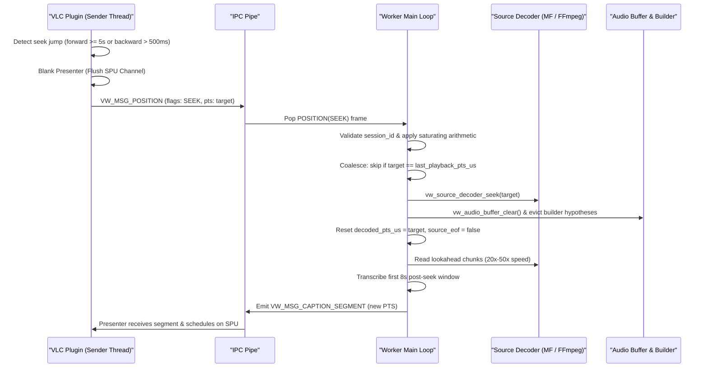

# Implementation Task Plan: Step 17d

# Task: Seek Re-Sync Engine & Discontinuity Discrimination (Look-Ahead Phase 3)

> **Revision v3 (2026-08-19) — refined per design review and architectural critique.** 
> Incorporates:
> 1. **Compiler-safe saturating arithmetic**: Uses standard C17 builtins (`__builtin_add_overflow` / `__builtin_sub_overflow`) to eliminate signed integer `INT64_MIN` corner-case UB.
> 2. **Realtime PTS tracking in source mode**: `vw_plugin_filter` updates `last_pts_us` and evaluates the 5s discontinuity gate, skipping only the expensive downsampler and SPSC push when `source_mode_active` is true.
> 3. **Protocol v1.2 bump**: Documents the minor version bump for the 1-byte `VW_MSG_STARTED` payload (`source_active`) and updates codec, validator, and API contract docs.
> 4. **Input item lifetime & MinGW linkage**: Relies on the held `input_thread_t` reference during the 100ms poll to guard `input_item_GetURI` without introducing unexported MinGW symbols.
> 5. **Pause blanking baseline**: Formally marks pause/resume SPU blanking as verified baseline (shipped in commit `e2493c4`).

---

## Goal
Harden the Step 17c seek re-sync engine with: a consolidated 5-second forward-jitter gate (`VW_INPUT_JUMP_DISCONTINUITY_US = 5000000LL`) applied to both the realtime audio callback and position-poll detectors so network transport jitter never false-triggers caption dropouts; compiler-safe saturating timeline arithmetic; strict `VW_MSG_POSITION` validation; mid-session playlist media-swap support; and gating of live PCM capture/IPC in source lookahead mode via a Protocol v1.2 `VW_MSG_STARTED` activation signal.

---

## Context
- **Relevant docs & ADRs**:
  - `docs/architecture.md` (Session state machine, Seeking & Discontinuity policy, SPU presentation architecture).
  - `docs/plans/step17_restart_deprecation_plan.md` (Baseline: MVP `STOP(SEEK_DISCONTINUITY)` teardown retired in 17c).
  - `docs/plans/step17c_plan.md` (Baseline: source-mode lookahead decoding, `VW_MSG_POSITION` pacing, seek re-sync shipped in 17c / PR #11 / `ce042e5`).
  - `docs/plans/phrase_timing_segmentation_plan.md` (ADR-017 phrase timing dependency baseline).
  - `docs/api-contracts.md` (Protocol v1.2 `VW_MSG_POSITION`, `VW_MSG_STARTED` payload, `VW_CAPABILITY_SOURCE_MODE`).
  - `docs/roadmap.md` (Step 17d milestone description).
- **VLC/worker/protocol version affected**:
  - Protocol: Protocol v1.2 (`VW_PROTOCOL_VERSION_MAJOR = 1, MINOR = 2`, `VW_CLIENT_VERSION = "1.2.0"`, `VW_WORKER_VERSION = "1.2.0"`).
  - VLC: Pinned VLC 3.0.23 (Windows x64 / Linux x64).
  - Worker: `vlc-whisper-worker` (Vulkan GPU) & `vlc-whisper-worker-cpu`.
- **Baseline already shipped in 17c (verify only)**:
  - `VW_MSG_POSITION(SEEK)` on plugin discontinuity → worker `vw_source_decoder_seek` + `vw_audio_buffer_clear` + builder hypothesis eviction, no `STARTED` handshake, no worker restart (`worker/src/vw_worker.c`).
  - `vw_caption_presenter_blank()` flushing SPU channel on seek and pause/resume transitions (`vw_whisper_module.c:342-360`).
- **Assumptions and explicit non-goals**:
  - Non-goal: Phrase-by-phrase timing segmentation — tracked in roadmap item **17d.1** (`ADR-017`).
  - Non-goal: Beam search quality passes — deferred to roadmap item **17e**.
  - Assumption: Local media playback delivers valid file URIs (`file://` or absolute paths); network streams seamlessly use live PCM streaming mode.

---

## Scope

### Baseline (17c, verify only)
1. `VW_MSG_POSITION(SEEK)` re-anchoring: demuxer re-seek, buffer purge, builder eviction, resumed lookahead without teardown. Add regression coverage; do not redesign.
2. Presenter SPU blank on seek and pause/resume (`vw_caption_presenter_blank()` → `vout_FlushSubpictureChannel`), channel registration preserved.

### In Scope (17d deltas)
1. **Consolidated 5-Second Forward-Jitter Gate**:
   - Apply `VW_INPUT_JUMP_DISCONTINUITY_US = 5000000LL` (5 s) for FORWARD jumps in both detectors:
     - Realtime callback PTS path (`vw_plugin_filter`).
     - Throttled position-poll path (`vw_plugin_sender_main`).
   - Backward jumps keep the `VW_PTS_JUMP_THRESHOLD_US = 500000LL` (500 ms) rule in both detectors.
   - Position-poll forward threshold scales with playback rate: `(int64_t)(VW_INPUT_JUMP_DISCONTINUITY_US * (rate > 1.0f ? rate * 1.5f : 1.0f))`.
   - `BLOCK_FLAG_DISCONTINUITY` with valid PTS is gated by the 5s forward / 500ms backward rule; discontinuities with invalid/absent PTS fall through to the position-poll detector.
   - Forward jumps $\ge 5\text{s}$ and backward jumps $> 500\text{ms}$ trigger seek re-sync: blank presenter + `POSITION(SEEK)` + SPSC drain.
2. **Compiler-Safe Saturating Arithmetic & Protocol Validation**:
   - Implement `vw_saturating_add_i64` and `vw_saturating_sub_i64` using `__builtin_add_overflow` / `__builtin_sub_overflow` in a new shared header `protocol/include/vw_protocol_util.h`.
   - Update `vw_protocol_validate.c` for `VW_MSG_POSITION`: reject `current_pts_us`/`input_time_us` outside legal media range (floor `-10 s`, ceiling `10 years`), `playback_rate` non-finite (`!isfinite`), $\le 0$ or $> 16$, and any flag bit outside `(VW_POSITION_FLAG_SEEK | VW_POSITION_FLAG_PAUSED)`.
3. **Dynamic Playlist & Media Item Swap Detection**:
   - Plugin: throttled poll (100 ms) checks `input_GetItem(input)` → `input_item_GetURI` into a stack buffer. Lifetime is guarded by the held `input_thread_t` reference from `vw_plugin_find_input`.
   - On URI change: blank presenter, `vw_worker_client_stop_session(client, VW_CTRL_REASON_MEDIA_END)`, drain SPSC queue, generate new `session_id`, `vw_worker_client_start_session(client, 0, model, new_uri)`.
   - Worker: rewrite `VW_MSG_START_SESSION` handler. On START with a `session_id` different from the active one: close previous `source_decoder`, clear `audio_buf`/`builder`, open the new MRL, set `session_active = true`, emit `VW_MSG_STARTED`. Never drop in-session START frames.
4. **PCM Capture & IPC Gating in Source Mode (Protocol v1.2 Activation-Signaled)**:
   - **Protocol v1.2 bump**: extend `VW_MSG_STARTED` from 0-byte header-only to a 1-byte payload `vw_msg_started_t { uint8_t source_active; }`.
   - Worker: `source_active = (source_decoder != NULL)` in STARTED. On demuxer open failure, emit `E_SOURCE_OPEN` (recoverable = 1) before STARTED and set `source_active = 0`.
   - Plugin: `_Atomic bool sys->source_mode_active` set from the STARTED `source_active` (and cleared on session stop / worker death).
   - Realtime callback (`vw_plugin_filter`): updates `sys->capture.last_pts_us` and evaluates the 5s discontinuity gate, but skips float-to-int16 downsampling and SPSC pushes when `source_mode_active == true`.
   - Sender thread (`vw_plugin_sender_main`): skips `send_audio` when `source_mode_active == true`.
5. **Worker Seek Coalescing (Scrub Bursts)**:
   - In `vw_worker.c`: skip demuxer re-seek when `target_pts == last_playback_pts_us`. Drain intermediate `POSITION(SEEK)` frames during rapid scrub bursts to apply the latest target without backlog.

### Out of Scope
- Sub-window phrase timestamp extraction ($t_0/t_1$) — tracked in **Step 17d.1**.
- Model beam search decoding or temperature fallback — tracked in **Step 17e**.

### Files Expected to Change
- `protocol/include/vw_protocol_types.h` (Bump `VW_PROTOCOL_VERSION_MINOR` to 2, add `vw_msg_started_t`).
- `protocol/include/vw_protocol_util.h` (New shared header with `vw_saturating_add_i64`, `vw_saturating_sub_i64`).
- `protocol/src/vw_protocol_codec.c` (STARTED payload encode/decode).
- `protocol/src/vw_protocol_validate.c` (STARTED payload validation, `VW_MSG_POSITION` bounds/rate/flag checks).
- `plugin/include/vw_platform.h` (Add `VW_INPUT_JUMP_DISCONTINUITY_US`).
- `plugin/include/vw_worker_client.h` & `plugin/src/vw_worker_client.c` (STARTED payload decode, `source_active` exposure).
- `plugin/src/vw_whisper_module.c` (5s dual-detector gate, media-swap poll, PCM capture gating in callback).
- `worker/src/vw_worker.c` (START handler rewrite for media swap, seek coalescing, saturating math, STARTED `source_active` payload).
- `tests/unit/test_protocol_codec.c` (STARTED round-trip test).
- `tests/unit/test_protocol_validate.c` (Bounds, rate, flags, and STARTED payload test cases).
- `tests/unit/test_protocol_util.c` (New unit test for saturating math boundary values).
- `tests/integration/test_worker_lifecycle.c` (Seek repositioning, rapid scrub burst, media swap with in-test generated WAV fixtures).
- `diff.md` & `docs/` (`api-contracts.md`, `architecture.md`, `source-layout.md`, `roadmap.md` — Rule 14).

---

## Design

### 1. Discontinuity Gating — Both Detectors



- **Forward rule**: $|\Delta\text{PTS}| \ge 5\text{s}$ (callback and poll).
- **Backward rule**: $\Delta\text{PTS} < -500\text{ms}$ (callback and poll).
- Network streams with genuine $< 5\text{s}$ PCR slips / re-buffers continue captions without blanking or IPC interruption.

### 2. Worker Seek Re-Sync Flow



### 3. Media Swap Handling (Seamless Track Advance)

- **Detection**: Throttled poll (100 ms) inspects `input_GetItem(input)` → `input_item_GetURI`. Lifetime is protected by the held `input_thread_t` reference. If URI differs from `sys->active_source_url`:
  1. `vw_worker_client_stop_session(sys->client, VW_CTRL_REASON_MEDIA_END)`.
  2. `vw_caption_presenter_blank(&sys->presenter)`.
  3. Generate new `session_id`; call `vw_worker_client_start_session(sys->client, 0, model, new_uri)`.
- **Worker acceptance (`VW_MSG_START_SESSION`)**:
  - If `session_active && memcmp(session_id, payload.start.session_id, 16) != 0`:
    - Log `WORKER_SESSION: media swap / new epoch`.
    - Close previous `source_decoder`.
    - Clear `audio_buf` and evict builder hypotheses.
    - Open new `source_decoder` for `new_uri`.
    - Set `session_active = true`.
    - Emit `VW_MSG_STARTED(source_active = (source_decoder != NULL))`.
  - If `session_active && memcmp == 0`: duplicate START ignored.

### 4. Compiler-Safe Saturating Arithmetic (`protocol/include/vw_protocol_util.h`)

```c
#ifndef VW_PROTOCOL_UTIL_H_
#define VW_PROTOCOL_UTIL_H_

#include <stdint.h>

static inline int64_t vw_saturating_add_i64(int64_t a, int64_t b) {
  int64_t res;
  if (__builtin_add_overflow(a, b, &res)) {
    return (b > 0) ? INT64_MAX : INT64_MIN;
  }
  return res;
}

static inline int64_t vw_saturating_sub_i64(int64_t a, int64_t b) {
  int64_t res;
  if (__builtin_sub_overflow(a, b, &res)) {
    return (b < 0) ? INT64_MAX : INT64_MIN;
  }
  return res;
}

#endif  // VW_PROTOCOL_UTIL_H_
```

---

## Acceptance Criteria

- [ ] **5s Discontinuity Gate (both detectors)**: Network transport jitter and small buffer slips (forward $|\Delta\text{PTS}| < 5\text{s}$, including `BLOCK_FLAG_DISCONTINUITY`) do NOT clear presenter captions and do NOT send `POSITION(SEEK)` — verified for both the realtime callback path and the 100 ms position-poll path.
- [ ] **True Seek Re-Sync**: Forward jumps $\ge 5\text{s}$ and backward jumps $> 500\text{ms}$ (paused or playing) immediately flush SPU captions, re-seek worker demuxer, and resume transcription from the new PTS without worker process restart.
- [ ] **Saturating Arithmetic**: Extreme or wrapped timestamp values cannot cause integer overflow, undefined behavior, or worker stalls (unit-tested with `INT64_MAX` and `INT64_MIN`).
- [ ] **Protocol v1.2 Validation**: `vw_protocol_validate_payload` strictly rejects out-of-range timestamps, non-finite / non-positive / >16x playback rates, and unknown position flag bits; `VW_MSG_STARTED` round-trips `source_active`.
- [ ] **Playlist Media Swap**: Changing tracks mid-session triggers a clean epoch transition; worker closes the old demuxer and opens the new MRL (in-session START accepted), emitting STARTED — verified with in-test generated WAV fixtures.
- [ ] **PCM Gating in Source Mode**: When STARTED reports `source_active = 1`, realtime downsampling and live `send_audio` are bypassed while PTS tracking in the callback is preserved; when demuxer open fails (`source_active = 0`), live PCM capture continues transparently.
- [ ] **SPU Anti-Ghosting**: SPU channel is flushed on every seek and on pause/resume transitions; no stale lookahead subtitles display after either event.
- [ ] **Zero Memory Leaks**: Valgrind reports 0 memory errors across the entire test suite.
- [ ] **Documentation**: `docs/architecture.md`, `docs/api-contracts.md`, `docs/source-layout.md`, `docs/roadmap.md`, and `diff.md` updated in the same change (Rule 14).

---

## Implementation Steps

### Phase 1: Protocol v1.2 & Saturating Helpers
1. Update `protocol/include/vw_protocol_types.h`: bump `VW_PROTOCOL_VERSION_MINOR` to 2, define `vw_msg_started_t { uint8_t source_active; }`.
2. Create `protocol/include/vw_protocol_util.h` with `vw_saturating_add_i64` and `vw_saturating_sub_i64`.
3. Add `tests/unit/test_protocol_util.c` testing boundary overflow values.
4. Update `protocol/src/vw_protocol_codec.c` and `protocol/src/vw_protocol_validate.c` to encode, decode, and validate `VW_MSG_STARTED` (1-byte payload) and `VW_MSG_POSITION` bounds/rate/flags.
5. Update `tests/unit/test_protocol_codec.c` and `tests/unit/test_protocol_validate.c`.

### Phase 2: Worker Seek Engine & Media Swap
1. Rewrite `VW_MSG_START_SESSION` in `worker/src/vw_worker.c` to support in-session replacement on new `session_id`. Emit `VW_MSG_STARTED` carrying `source_active`.
2. Update `VW_MSG_POSITION` in `worker/src/vw_worker.c` with saturating arithmetic, seek coalescing, and demuxer re-seek.
3. Emit `E_SOURCE_OPEN` if source demuxer open fails.
4. Add integration tests for seek repositioning, rapid scrub burst, and media swap in `tests/integration/test_worker_lifecycle.c`.

### Phase 3: Plugin Discontinuity Gating & PCM Streaming Gate
1. Update `plugin/include/vw_platform.h`: define `VW_INPUT_JUMP_DISCONTINUITY_US = 5000000LL`.
2. Update `plugin/src/vw_worker_client.c`: decode `source_active` from `VW_MSG_STARTED`.
3. Update `vw_plugin_filter` in `plugin/src/vw_whisper_module.c`: 5s forward / 500ms backward gate; update `last_pts_us` and bypass downsampling/SPSC push when `source_mode_active == true`.
4. Update `vw_plugin_sender_main` in `plugin/src/vw_whisper_module.c`: 5s rate-scaled gate on position poll, dynamic `input_item_GetURI` media-swap detection, and gate `send_audio` on `source_mode_active`.
5. Update `tests/unit/test_caption_presenter.c` verifying SPU blanking persistence and pause flushing.

### Phase 4: Verification & Documentation Updates
1. Run `clang-format --dry-run --Werror` across all modified files.
2. Build and run test suite across `linux-x64-debug` and `linux-x64-debug-cpu` presets (`-j1`).
3. Run Valgrind memory leak verification (`ctest -T memcheck`).
4. Update `docs/architecture.md`, `docs/api-contracts.md`, `docs/source-layout.md`, `docs/roadmap.md`, and `diff.md`.

---

## Test Plan

### Automated Test Matrix
1. **`test_protocol_validate`**:
   - `VW_MSG_POSITION` rejects `current_pts_us < -10s` and `> 10 years`.
   - Rejects `playback_rate = NAN`, `-1.0f`, `0.0f`, `17.0f`; accepts `1.0f`, `16.0f`.
   - Rejects invalid flag bits (`0x04`, `0x80`); accepts `SEEK | PAUSED`.
   - STARTED payload: 1 byte accepted, 0 bytes rejected, round-trips `source_active`.
2. **`test_protocol_util`** (new):
   - `vw_saturating_add_i64` with `INT64_MAX + 1000` $\rightarrow$ `INT64_MAX`.
   - `vw_saturating_add_i64` with `INT64_MIN + (-1000)` $\rightarrow$ `INT64_MIN`.
   - `vw_saturating_sub_i64` with `INT64_MIN - 1000` $\rightarrow$ `INT64_MIN`.
   - `vw_saturating_sub_i64` with `INT64_MAX - (-1000)` $\rightarrow$ `INT64_MAX`.
   - Tests with `b = INT64_MIN`.
3. **`test_caption_presenter`**:
   - SPU channel persistence across 10 rapid `blank()` calls.
   - SPU channel flush on seek jumps and pause transitions.
   - Rate-scaled wall-clock scheduling at 0.5x, 1.0x, 2.0x.
4. **`test_worker_ipc` & `test_worker_lifecycle`**:
   - `VW_MSG_POSITION(SEEK)` repositions lookahead decoding.
   - Rapid scrub burst (15 seek frames in <50 ms) without worker crash or pipe stall.
   - Media swap: START session 1 (`sample1.wav`), then in-session START session 2 (`sample2.wav`) — old decoder closed, new decoder transcribes, STARTED received for both epochs. Fixtures generated in-test via synthetic WAV generator.
5. **Valgrind Memcheck**:
   - `ctest --test-dir build/linux-x64-debug -T memcheck` with 0 errors.

---

## Definition of Done
- [ ] Standard C17 code (`-std=c17`), no project-authored C++.
- [ ] Zero blocking locks, allocations, or I/O in VLC audio filter callback.
- [ ] Zero network requests, telemetry, transcript logging, or privacy leaks.
- [ ] All queue and memory bounds explicitly enforced.
- [ ] Error path preserves VLC playback unconditionally.
- [ ] 100% passing test suite across debug and CPU presets.
- [ ] `clang-format` code style clean with 0 warnings.
- [ ] All repository documentation updated in the same change (Rule 14).
